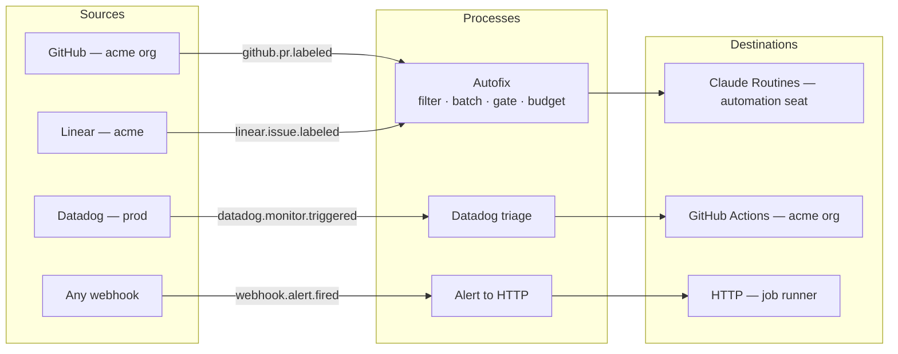

# AI Switchboard

AI Switchboard is an open-source service that turns events from the systems a team already runs
(GitHub, Linear, Datadog, any webhook) into controlled invocations of the automations they
already have (Claude Routines, HTTP endpoints, GitHub Actions workflows). A person wires event
types to processes on a canvas, and every process runs through one pipeline under the budgets,
meter ceilings, schedules and approval gates the same UI controls. Sources, destinations, notifiers
and secret providers are npm packages. Installing one registers it, and its event types and
settings forms appear in the UI. It runs as one container plus Postgres.



Sources emit **events**. A **process** subscribes to event types through **triggers**, filters,
batches and gates them, checks **budgets** and **meter** ceilings, and starts one **run** through
an **destination**. A batch that a gate stops is **held**. A batch that a budget or ceiling stops is
**throttled**. Neither is a failure: the process's next **sweep** (a scheduled run) does the work.

## Quick start

You need Docker with Compose, and nothing else. The full walk-through is in
[docs/quick-start.md](docs/quick-start.md).

```bash
git clone https://github.com/ai-switchboard/switchboard.git && cd switchboard
docker compose -f deploy/docker-compose.yml up -d --build
docker compose -f deploy/docker-compose.yml logs switchboard | grep -i password
```

1. Open <http://localhost:8080> and sign in as `admin@switchboard.local` with the password from
   the log, then choose your own.
2. **Sources → Add source → Webhook.** Name it `Test hook`, set **Verification** to _None_
   (evaluation only) and keep **How deliveries become events** on _Quick_: every delivery becomes one event whose
   attributes are the body's top-level fields. Set **Artifact id path** to `body.id`.
3. **Destinations → Add destination → Log (test destination).** It writes every run to the server log.
4. **Processes → New process.** Add a trigger on `Test hook` / `webhook.request.received` with
   the filter `attributes.severity = 'critical'`, pick the `Log` destination, and save.
5. Send it anything:

   ```bash
   curl -X POST http://localhost:8080/hooks/<sourceId> -H 'content-type: application/json' \
     -d '{"id": 1, "title": "Deploy failed", "severity": "critical"}'
   ```

6. **Activity** shows the event walk received → matched → batched → gated → invoked → ok; the
   run is in the log (`docker compose -f deploy/docker-compose.yml logs switchboard | grep "log destination"`).
   Send `"severity": "warning"` and the trace tells you why nothing ran.

Prefer files to clicking? `switchboard apply -f examples/log-destination.yaml --reason "quick start"`
creates the same source, destination and process (see [examples/](examples/README.md)). To try signed
webhooks and real HTTP calls, the optional `stub` Compose profile provides a fake backend
([quick start › going further](docs/quick-start.md#going-further-signed-webhooks-and-a-real-http-call)).
To see every event as one trace with its logs and metrics in Grafana, start the `observability`
profile: `docker compose -f deploy/docker-compose.yml --env-file deploy/observability.env up -d`
and open http://localhost:3000 ([observability](docs/observability.md)).

## Documentation

| Document                                           | For                                                                                  |
| -------------------------------------------------- | ------------------------------------------------------------------------------------ |
| [Quick start](docs/quick-start.md)                 | The ten-minute first run, no external services                                       |
| [Concepts](docs/concepts.md)                       | The ten nouns, held and throttled, the pipeline stages and the outcome vocabulary    |
| [Architecture](docs/architecture.md)               | Components, runtime, deployment shape, exactly-once, replicas                        |
| [Configuration](docs/configuration.md)             | Environment variables, the YAML format for `export`/`apply`, global settings         |
| [Plugin author guide](docs/plugin-author-guide.md) | Writing a source, destination, notifier or secret provider; the conformance kit      |
| [REST API](docs/api.md)                            | Every route, role and body                                                           |
| [Runbook](docs/runbook.md)                         | Why did this not run, breakers, rotation, replay, CI apply, doctor, backups, scaling |
| [Security](docs/security.md)                       | Sign-in, roles, secrets, plugin trust, hardening checklist                           |
| [Observability](docs/observability.md)             | Traces, metrics and logs over OTLP, Prometheus, the Grafana dashboard                |
| [Technical Design](docs/technical-design.md)       | The authoritative design                                                             |

## CLI

```text
switchboard plugins add <spec>        install a plugin into $SWITCHBOARD_HOME/plugins and pin it
switchboard plugins remove <name>     uninstall a plugin
switchboard plugins list              installed plugins from plugins.lock.json
switchboard plugins inspect <spec>    version, SDK range, integrity and capabilities, without installing
switchboard export [-o file]          the whole configuration as YAML
switchboard apply -f file [--dry-run] [--reason "<text>"]   # --reason unless reasons are optional
switchboard doctor                    database, migrations, plugins, secrets, instance health
switchboard serve                     start the server
switchboard users list                every account: email, role, sign-in methods (on the server)
switchboard users reset-password <email>   a temporary password when someone is locked out
switchboard users create-admin <email>     break glass: a local admin with a temporary password
```

Server commands take `--url` (`SWITCHBOARD_URL`, default `http://localhost:8080`) and `--token`
(`SWITCHBOARD_TOKEN`). Plugin commands take `--home` (`SWITCHBOARD_HOME`, default `./.switchboard`).

## Plugins and naming

Admins install plugins from the UI: **Plugins → Browse npm** searches the registry
(`SWITCHBOARD_NPM_REGISTRY`), and **Add source / Add destination** offer "Find more on npm". Each
install shows the package's capabilities and SDK compatibility first, asks for a reason, and loads
the plugin at once on every replica; only upgrading or removing a loaded plugin waits for a
restart. Search finds packages named

- `ai-switchboard-{kind}-{name}` or `@scope/ai-switchboard-{kind}-{name}`, or
- `@ai-switchboard/{kind}-{name}` (the project's own scope),

where `{kind}` is `source`, `destination`, `notifier` or `secrets`. See the
[plugin author guide](docs/plugin-author-guide.md#naming).

## Deploying

- **Container image:** `ghcr.io/ai-switchboard/switchboard:1.0.0`, with the reference plugins
  baked in. Add plugins at build time with
  `--build-arg SWITCHBOARD_PLUGINS="@acme/switchboard-source-jira@^1"` (see `deploy/Dockerfile`).
- **Compose:** `deploy/docker-compose.yml` for evaluation, `deploy/docker-compose.test.yml` for the
  integration and end-to-end stack.
- **Kubernetes:** the Helm chart in `deploy/helm/switchboard` runs two replicas behind an ingress
  with a Postgres you supply.
- **Grafana:** `deploy/grafana/switchboard-dashboard.json`.

## Repository layout

```text
packages/sdk      @ai-switchboard/sdk     plugin interfaces, definePlugin, HttpClient, verifyHmac, conformance kit (/testing)
packages/core     @ai-switchboard/core    Fastify server: plugin host, pipeline, scheduler, REST API, auth, telemetry
packages/ui       @ai-switchboard/ui      React + Vite SPA, built into packages/core/public
packages/cli      @ai-switchboard/cli     the switchboard command
plugins/*         reference plugins       source-*, destination-*, notifier-*, secrets-*
deploy/           Dockerfile, Compose files, Helm chart, Grafana dashboard, stub server
docs/             quick start, concepts, architecture, configuration, API, plugin author guide, runbook
examples/         YAML configurations
```

## Development

Node 24 LTS and pnpm 10 through corepack (`corepack enable`).

```bash
pnpm install
pnpm typecheck            # tsc in every package (runs from source, no build needed)
pnpm lint                 # eslint, zero warnings
pnpm format               # prettier --write
pnpm test                 # unit tests (no Docker)
pnpm test:integration     # needs Docker (Testcontainers) or DATABASE_URL
pnpm vitest run --project ui
pnpm build                # all packages, UI last
pnpm dev                  # core with tsx watch (needs DATABASE_URL); pnpm dev:ui for Vite
pnpm db:generate          # after editing packages/core/src/db/schema.ts
pnpm check                # typecheck + lint + format:check + unit tests, before committing
```

Run one test file with `pnpm vitest run packages/core/src/pipeline/batch.test.ts`. Conventions
for code, tests and commits are in [CLAUDE.md](CLAUDE.md) and `.claude/rules/`.

## License

Apache-2.0. See [LICENSE](LICENSE).
