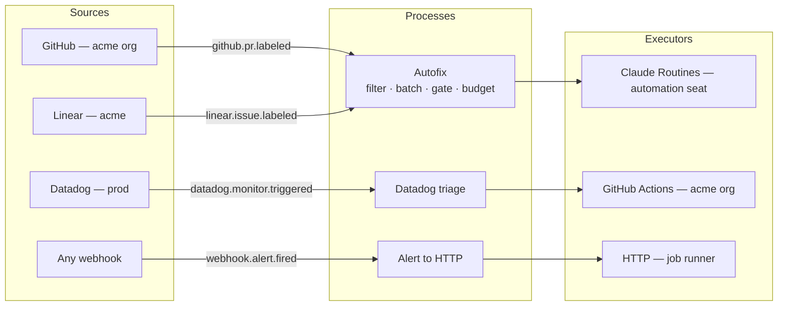

# AI Switchboard

AI Switchboard is an open-source service that turns events from the systems a team already runs
(GitHub, Linear, Datadog, any webhook) into controlled invocations of the automations they
already have (Claude Routines, HTTP endpoints, GitHub Actions workflows). A person wires event
types to processes on a canvas, and every process runs through one pipeline under the budgets,
meter ceilings, schedules and approval gates the same UI controls. Sources, executors, notifiers
and secret providers are npm packages. Installing one registers it, and its event types and
settings forms appear in the UI. It runs as one container plus Postgres.



Sources emit **events**. A **process** subscribes to event types through **triggers**, filters,
batches and gates them, checks **budgets** and **meter** ceilings, and starts one **run** through
an **executor**. A batch that a gate stops is **held**. A batch that a budget or ceiling stops is
**throttled**. Neither is a failure: the process's next **sweep** (a scheduled run) does the work.

## Quick start

You need Docker with Compose. The full step-by-step walk-through is in
[docs/quick-start.md](docs/quick-start.md).

```bash
git clone https://github.com/ai-switchboard/switchboard.git && cd switchboard
docker compose -f deploy/docker-compose.yml --profile stub up -d
docker compose -f deploy/docker-compose.yml logs switchboard | grep -i password
```

1. Open <http://localhost:8080> and sign in as the local admin with the password from the log.
   Evaluation mode prints it once; a banner reminds you that OIDC is not configured.
2. **Sources → New source → Webhook.** Name it `Stub alerts`, keep HMAC verification, set the
   secret to `secret://env/WEBHOOK_SECRET`, declare the event type `webhook.alert.fired` and
   paste the mapping from [examples/webhook-to-http.yaml](examples/webhook-to-http.yaml).
3. **Executors → New executor → HTTP.** Name it `Stub HTTP`, base URL `http://stub:9090`.
4. **Processes → New process.** Add a trigger on `Stub alerts` / `webhook.alert.fired`, bind
   `Stub HTTP` with target `POST /exec`, sync tracking, and save with a reason.
5. Send a signed test event through the stub:

   ```bash
   curl -X POST "http://localhost:9090/send?target=http://switchboard:8080/hooks/<sourceId>&secret=change-me-webhook-secret"
   ```

6. **Activity** shows the event walk received → matched → batched → gated → invoking → ok, and
   the run links to the stub's response.

Prefer files to clicking? `switchboard apply -f examples/webhook-to-http.yaml --reason "quick start"`
creates the same source, executor and process (see [examples/](examples/README.md)).

## Documentation

| Document                                           | For                                                                                  |
| -------------------------------------------------- | ------------------------------------------------------------------------------------ |
| [Quick start](docs/quick-start.md)                 | The ten-minute first run with the stub server                                        |
| [Concepts](docs/concepts.md)                       | The ten nouns, held and throttled, the pipeline stages and the outcome vocabulary    |
| [Architecture](docs/architecture.md)               | Components, runtime, deployment shape, exactly-once, replicas                        |
| [Configuration](docs/configuration.md)             | Environment variables, the YAML format for `export`/`apply`, global settings         |
| [Plugin author guide](docs/plugin-author-guide.md) | Writing a source, executor, notifier or secret provider; the conformance kit         |
| [REST API](docs/api.md)                            | Every route, role and body                                                           |
| [Runbook](docs/runbook.md)                         | Why did this not run, breakers, rotation, replay, CI apply, doctor, backups, scaling |
| [Security](docs/security.md)                       | Sign-in, roles, secrets, plugin trust, hardening checklist                           |
| [Observability](docs/observability.md)             | Signals, Prometheus and OTLP, the Grafana dashboard                                  |
| [Technical Design](docs/technical-design.md)       | The authoritative design                                                             |

## CLI

```text
switchboard plugins add <spec>        install a plugin into $SWITCHBOARD_HOME/plugins and pin it
switchboard plugins remove <name>     uninstall a plugin
switchboard plugins list              installed plugins from plugins.lock.json
switchboard plugins inspect <spec>    version, SDK range, integrity and capabilities, without installing
switchboard export [-o file]          the whole configuration as YAML
switchboard apply -f file [--dry-run] --reason "<text>"
switchboard doctor                    database, migrations, plugins, secrets, instance health
switchboard serve                     start the server
```

Server commands take `--url` (`SWITCHBOARD_URL`, default `http://localhost:8080`) and `--token`
(`SWITCHBOARD_TOKEN`). Plugin commands take `--home` (`SWITCHBOARD_HOME`, default `./.switchboard`).

## Plugins and naming

Admins install plugins from the UI: **Plugins → Browse npm** searches the registry
(`SWITCHBOARD_NPM_REGISTRY`), and **Add source / Add executor** offer "Find more on npm". Each
install shows the package's capabilities and SDK compatibility first, asks for a reason, and loads
the plugin at once on every replica; only upgrading or removing a loaded plugin waits for a
restart. Search finds packages named

- `ai-switchboard-{kind}-{name}` or `@scope/ai-switchboard-{kind}-{name}`, or
- `@ai-switchboard/{kind}-{name}` (the project's own scope),

where `{kind}` is `source`, `executor`, `notifier` or `secrets`. See the
[plugin author guide](docs/plugin-author-guide.md#naming).

## Deploying

- **Container image:** `ghcr.io/ai-switchboard/switchboard:1.0.0`, with the reference plugins
  baked in. Add plugins at build time with
  `--build-arg SWITCHBOARD_PLUGINS="@acme/switchboard-source-jira@^1"` (see `deploy/Dockerfile`).
- **Compose:** `deploy/docker-compose.yml` for evaluation, `deploy/docker-compose.test.yml` for the
  integration and end-to-end stack.
- **Kubernetes:** the Helm chart in `deploy/helm/switchboard` runs two replicas behind an ingress
  with a Postgres you supply.
- **Grafana:** `deploy/grafana/switchboard-dashboard.json`.

## Repository layout

```text
packages/sdk      @ai-switchboard/sdk     plugin interfaces, definePlugin, HttpClient, verifyHmac, conformance kit (/testing)
packages/core     @ai-switchboard/core    Fastify server: plugin host, pipeline, scheduler, REST API, auth, telemetry
packages/ui       @ai-switchboard/ui      React + Vite SPA, built into packages/core/public
packages/cli      @ai-switchboard/cli     the switchboard command
plugins/*         reference plugins       source-*, executor-*, notifier-*, secrets-*
deploy/           Dockerfile, Compose files, Helm chart, Grafana dashboard, stub server
docs/             quick start, concepts, architecture, configuration, API, plugin author guide, runbook
examples/         YAML configurations
```

## Development

Node 24 LTS and pnpm 10 through corepack (`corepack enable`).

```bash
pnpm install
pnpm typecheck            # tsc in every package (runs from source, no build needed)
pnpm lint                 # eslint, zero warnings
pnpm format               # prettier --write
pnpm test                 # unit tests (no Docker)
pnpm test:integration     # needs Docker (Testcontainers) or DATABASE_URL
pnpm vitest run --project ui
pnpm build                # all packages, UI last
pnpm dev                  # core with tsx watch (needs DATABASE_URL); pnpm dev:ui for Vite
pnpm db:generate          # after editing packages/core/src/db/schema.ts
pnpm check                # typecheck + lint + format:check + unit tests, before committing
```

Run one test file with `pnpm vitest run packages/core/src/pipeline/batch.test.ts`. Conventions
for code, tests and commits are in [CLAUDE.md](CLAUDE.md) and `.claude/rules/`.

## License

Apache-2.0. See [LICENSE](LICENSE).
