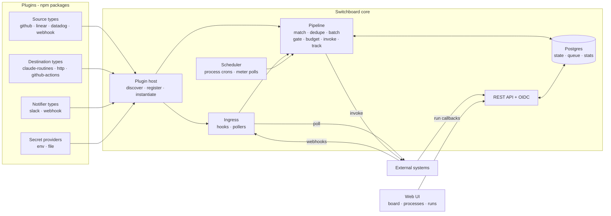

# Architecture

One Node process hosts the HTTP server, the plugin host, the pipeline workers, the scheduler and
the UI. Postgres holds every piece of state and doubles as the job queue. Plugins are ordinary npm
packages loaded at boot. Two or more replicas run safely because all coordination goes through
Postgres.



## Three fixed things

Everything except these three is a plugin:

1. **The event envelope**: the one shape every source produces (`Event` in
   `packages/sdk/src/types/events.ts`).
2. **The dispatch pipeline**: receive → match → dedupe → batch → gate → budget → invoke/track,
   the one path every event, schedule tick and manual start walks (`packages/core/src/pipeline/`).
3. **The process**: one JSON document a person edits (`packages/core/src/domain/process.ts`).

## Components

| Component          | Responsibility                                                                                                                                                                                  |
| ------------------ | ----------------------------------------------------------------------------------------------------------------------------------------------------------------------------------------------- |
| Plugin host        | Discovers installed plugin packages, checks their SDK range, validates their manifests, registers their types and builds one live object per configured instance with its resolved secrets      |
| Ingress            | One route per push source instance (`/hooks/<sourceId>`): verify, store the raw delivery, parse, answer in under a second, enqueue. One poller per pull source instance with a stored watermark |
| Scheduler          | Every process's sweep crons and every destination's meter polls, on the Postgres job queue, so ticks survive restarts and fire once across replicas                                             |
| Pipeline           | The seven stages, each a transactional step over Postgres rows, run as queue jobs so any replica can process any step                                                                           |
| Expression engine  | JSONata with a fixed function library (`$resolve`, `$linked`, `$now`, `$env`, `$secretRef`) and a time and `$resolve` limit per evaluation                                                      |
| Destination bridge | Calls `invoke` with the mapped input, records the run, drives tracking (sync, poll, callback or none) and records usage and meters                                                              |
| REST API           | Everything the UI and the CLI do, OIDC and local sign-in, API tokens, run callbacks, YAML export and apply ([api.md](api.md))                                                                   |
| Web UI             | React single-page app served by the same process from `packages/core/public`                                                                                                                    |
| Postgres           | Configuration, events, runs, statistics, audit and the job queue (pg-boss), in one database                                                                                                     |

## Runtime and libraries

| Concern        | Choice                                                                                           |
| -------------- | ------------------------------------------------------------------------------------------------ |
| Runtime        | Node 24 LTS, TypeScript 6, ESM only                                                              |
| HTTP           | Fastify 5 (`@fastify/cookie`, `@fastify/rate-limit`, `@fastify/static`)                          |
| Database       | Postgres (17 in the Compose files), Drizzle ORM and drizzle-kit migrations                       |
| Jobs and crons | pg-boss on the same Postgres                                                                     |
| Expressions    | JSONata                                                                                          |
| Schemas        | Ajv, JSON Schema draft 2020-12                                                                   |
| Signals        | OpenTelemetry metrics and traces (OTLP and a Prometheus endpoint), pino JSON logs                |
| Sign-in        | openid-client (authorization code with PKCE), local password in evaluation mode, API tokens      |
| UI             | React 19, Vite, React Router, TanStack Query, React Flow (`@xyflow/react`), plain CSS tokens     |
| Tests          | Vitest (unit, integration with Testcontainers Postgres, UI with Testing Library), Playwright e2e |

## Packages

```text
packages/sdk      @ai-switchboard/sdk     plugin interfaces, definePlugin, HttpClient, verifyHmac, conformance kit (/testing)
packages/core     @ai-switchboard/core    Fastify server: plugin host, pipeline, scheduler, REST API, auth, telemetry
packages/ui       @ai-switchboard/ui      React + Vite SPA, built into packages/core/public
packages/cli      @ai-switchboard/cli     the switchboard command
plugins/*         reference plugins       source-webhook, source-poll-http, source-github, source-linear, source-datadog,
                                          destination-http, destination-claude-routines, destination-github-actions,
                                          notifier-slack, notifier-webhook, secrets-env, secrets-file
```

Inside the core, pipeline stages (`src/pipeline/`) are pure functions over plain data and `now`.
Persistence and I/O live in `src/services/`. Code takes time from an injected `Clock`, never
`Date.now()`, so every stage is tested with a fake clock and no database.

Build order is sdk → plugins → core → cli → ui. Every workspace package exports a
`@ai-switchboard/source` condition that points at `src/*.ts`, so typecheck, tests and `pnpm dev`
run from source with no build step.

## Plugin discovery and registration

At boot the plugin host scans the image's `node_modules`, `$SWITCHBOARD_HOME/plugins/node_modules`
and every directory in `SWITCHBOARD_PLUGIN_DIRS` for packages whose `package.json` carries a
`switchboard` field. For each one it:

1. Checks the declared `switchboard.sdk` range against the running SDK version. A package that
   does not include the running major is `incompatible` and not imported.
2. Imports `switchboard.entry` (or `switchboard.source` when `SWITCHBOARD_DEV_SOURCE=true`).
3. Validates the manifest: unique kebab-case ids, well-formed JSON Schemas for every settings,
   target, input and event type, flat attributes with conforming examples.
4. Upserts a `plugins` row and one `plugin_types` row per contributed type with the manifest.

A type that was present last boot and is missing now is marked unavailable. Its instances stay
configured, are shown as needing the plugin back, and their processes are held with
`plugin_unavailable`. Registration needs no migration. Installing or removing a plugin
(`switchboard plugins add`, or the Plugins page) takes effect at the next start.

## Deployment shape

One image, `ghcr.io/ai-switchboard/switchboard`, with the reference plugins baked in. Its tag
equals the core version.

```text
/app/core               the server (CMD node dist/main.js) and its node_modules, UI in public/
/app/cli                the switchboard CLI, on PATH
/opt/switchboard        SWITCHBOARD_HOME: plugins/ (npm prefix) and plugins.lock.json
```

- **Extra plugins at build time:** `--build-arg SWITCHBOARD_PLUGINS="@acme/switchboard-source-jira@^1 other@1.2.3"`
  runs `switchboard plugins add` for each spec during the build, so production deploys need no
  runtime install. Private registries use a BuildKit secret:
  `docker build --secret id=npmrc,src=$HOME/.npmrc --build-arg SWITCHBOARD_PLUGINS=... -f deploy/Dockerfile .`
- **Extra plugins at run time:** mount a volume at `/opt/switchboard`, run
  `switchboard plugins add <spec>` inside the container, then restart.
- **Evaluation:** `deploy/docker-compose.yml` runs the image and Postgres 17 (plus the stub with
  `--profile stub`).
- **Production:** the Helm chart in `deploy/helm/switchboard` runs two replicas behind an
  ingress with a pod disruption budget and a Postgres the operator supplies.

Secrets never live in Postgres. Settings store `secret://<provider>/<name>` references, and a
secret-provider plugin (`env`, `file`, or a community one for Vault, GCP or AWS) resolves them
when an instance is built.

## Exactly once where it matters

| Step                       | Guarantee                     | Mechanism                                                                                |
| -------------------------- | ----------------------------- | ---------------------------------------------------------------------------------------- |
| Ingress                    | At least once                 | Sources redeliver; ingress stores before it answers                                      |
| Match                      | Effectively once per process  | Unique `(process_id, dedupe_key)` for 7 days                                             |
| Budget reservation         | Once per batch                | The run row with `status=invoking` is the reservation; `runs.batch_id` is unique         |
| Invocation, not idempotent | At most once                  | A request that may have been sent is never retried; the run is `uncertain` until tracked |
| Invocation, idempotent     | At least once, deduplicated   | Retried with the same run id (`x-switchboard-run-id` for `http`)                         |
| Sweeps and meter polls     | Once per tick across replicas | pg-boss singleton jobs and crons                                                         |

## Replicas

Replicas are identical. Ingress is stateless, the pipeline is a job queue, and there is no
in-memory state anywhere in the pipeline: anything that must survive a restart is a row. pg-boss
hands each job to one replica at a time and re-delivers unfinished jobs after their visibility
timeout, so a rollout loses time, not work. A run left `invoking` past its attempt's deadline
(its `before` steps' budget, the destination's invoke timeout and a margin) becomes `uncertain`,
which tracking then settles; steps resume from their journal.

The live plugin objects (one per source, destination, notifier and secret provider instance, holding
resolved secrets) are the one thing each replica builds for itself. The replica that handles a
change rebuilds the instance immediately; every write that changes what an instance is built from
(name, settings, enabled) or asks for a reload increments the row's `config_version`. Each
replica runs a reconcile pass at boot and every `SWITCHBOARD_INSTANCE_SYNC_SECONDS` (10 s, a
per-replica timer, not a queue job, since every replica must do it): one `id, config_version`
query per instance table, compared with the version it last built, then it builds new rows,
rebuilds changed ones, drops deleted ones and rebuilds the dependents of any secret provider that
changed. Only changed rows are read in full. The replica that made a change recorded the version
it built, and instances with a rebuild in flight are skipped, so nothing is built twice; build
tickets keep an older build from replacing a newer one. Caps and target defaults are read from
the row where they are used, so they need no rebuild. Plugin installs converge through a
separate sync pass (`SWITCHBOARD_PLUGIN_SYNC_SECONDS`).

Each replica emits `switchboard.heartbeat` every 30 seconds and records itself for the About
panel (`GET /api/v1/about`). Two replicas are the recommended minimum for zero-downtime rollouts.
Set `SWITCHBOARD_WORKERS=false` for replicas that should serve the API and ingress only.

The design targets thousands of events an hour and hundreds of runs a day on a small Postgres. In
practice the bottleneck is the destination's capacity, which is what meters make visible.
