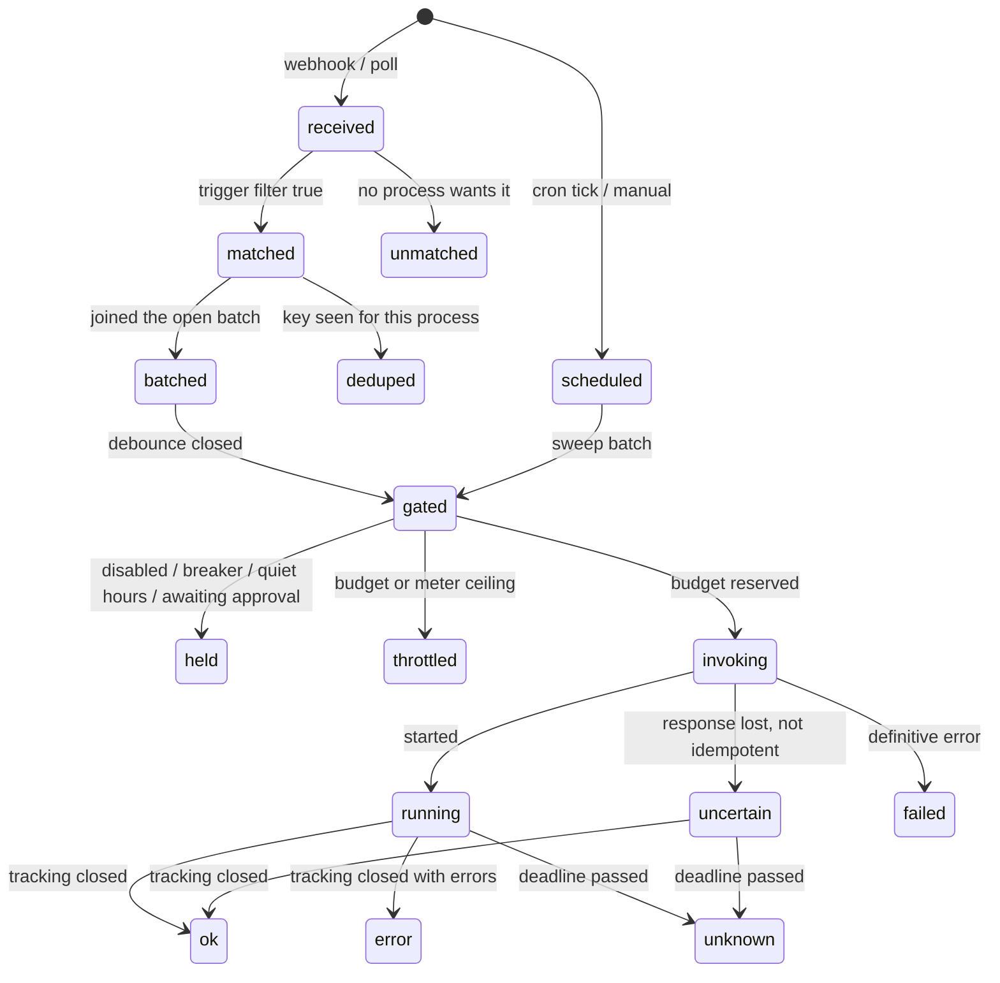

# Concepts

Ten nouns cover the whole system. The UI, the API, the SDK, the logs and these docs use exactly
these words and no synonyms.

| Term         | Meaning                                                                                                                                                                              | Where it comes from                                         |
| ------------ | ------------------------------------------------------------------------------------------------------------------------------------------------------------------------------------ | ----------------------------------------------------------- |
| **Plugin**   | An npm package that contributes one or more source types, executor types, notifier types or secret-provider types                                                                    | Installed by an admin                                       |
| **Source**   | An _instance_ of a source type, configured with credentials and settings: "GitHub — acme org", "Datadog — prod". A source emits events                                               | Created in the UI from an installed source type             |
| **Event**    | One normalised occurrence from a source: a type, a time, the artifact it is about, flat attributes, a dedupe key                                                                     | Produced by a source's `parse` or `poll`                    |
| **Process**  | A user-defined unit of automation: triggers, filter, batching, gates, budgets, schedules, an executor binding and an input mapping                                                   | Created in the UI                                           |
| **Trigger**  | One subscription inside a process: a source, one or more event types, a filter expression                                                                                            | Part of a process                                           |
| **Executor** | An _instance_ of an executor type, configured with credentials: "Claude Routines — automation seat". It invokes work, tracks runs and reports what they consumed                     | Created in the UI from an installed executor type           |
| **Run**      | One invocation of a process through its executor, from the moment budget is reserved to a terminal status, with the executor's external reference (a session URL, a workflow run id) | Produced by the pipeline                                    |
| **Usage**    | What one run consumed, in dimensions the executor type declares (tokens, billable minutes, dollars, seconds), budgetable per process                                                 | Declared by executor types, reported per run                |
| **Meter**    | A gauge an executor exposes about its remaining capacity: a rolling usage window, a daily allowance, a spend counter, with a reset time                                              | Declared by executor types, read per instance on a schedule |
| **Action**   | A side effect a source or executor can perform on request (add a label, mark ready, post a comment), usable as a step before or after a run                                          | Declared by plugins                                         |

A few more words have one meaning each:

- **Batch**: the events a process collected before deciding once. A batch closes on its debounce,
  its maximum size or its maximum age. Its kind is `event`, `sweep` or `manual`.
- **Sweep**: a scheduled run. A process's cron schedule fires a sweep batch that skips matching
  and enters the pipeline at the gate. A sweep is how a process catches up on anything a gate or
  a budget stopped.
- **Held**: a gate stopped the batch (process or instance disabled, breaker open, quiet hours,
  awaiting approval, backend paused).
- **Throttled**: a budget or a meter ceiling stopped the batch.
- **Breaker**: a per-process switch that opens after `threshold` consecutive `error` or `unknown`
  runs and holds everything until it is reset by hand or its cooldown passes.
- **Approval**: a person with the operator role releases or rejects a batch the approval rule
  stopped.
- **Budget** and **ceiling**: a budget caps runs or usage per process or executor instance per
  hour or day. A ceiling is a utilization percentage on one meter above which batches are
  throttled, set separately for event batches and sweeps.

**Held and throttled are not failures.** The batch is recorded with its reason and is not
re-queued. The process's next sweep does the work. That is why every limit is safe to set
aggressively.

## Types and instances

A plugin contributes _types_ (the `github` source type, the `claude-routines` executor type). A
person creates _instances_ of them (the source "GitHub — acme org" with its own credentials).
Instances are rows. The core builds one live object per enabled instance by resolving its
`secret://` references and calling the type's `create(settings)`. Changing an instance's settings
rebuilds that one object and nothing else.

## The event

```typescript
interface Event {
  id: string; // uuid, assigned by the core
  sourceId: string; // the source instance
  sourceType: string; // 'github'
  type: string; // '<sourceType>.<object>.<verb>', e.g. 'github.pr.labeled'
  occurredAt: string; // from the source when it has one
  receivedAt: string; // core clock
  artifact: { kind: string; id: string; url?: string; version?: string };
  attributes: Record<string, string | number | boolean | string[]>; // flat, declared
  dedupeKey: string; // stable for the same change delivered twice
  deliveryId?: string;
  rawRef: string; // pointer to the stored raw body
  replayOf?: string; // set on replayed events
}
```

Attributes are flat and declared per event type in the source type's JSON Schema, so the filter
editor can offer them by name and an undocumented payload change cannot break a filter. The
**artifact** is the durable thing the event is about (a pull request, an issue, a monitor). The
payload carries references, not state: the process that runs re-reads real state.

## The process

A process is one JSON document a person edits. There is no process code anywhere.

| Part                      | What it says                                                                                                                                                           |
| ------------------------- | ---------------------------------------------------------------------------------------------------------------------------------------------------------------------- |
| `triggers`                | Source instance, event types, JSONata filter, a `describe` sentence every screen shows                                                                                 |
| `schedules`               | Cron sweeps in a named timezone, with `catchUp: skip \| once` for ticks missed while nothing ran                                                                       |
| `batching`                | `debounceSeconds`, `maxSize`, `maxAgeSeconds`, optional `groupBy` expression (one batch per key); `maxSize: 1` is "off" (one run per event; the UI writes `0 / 1 / 0`) |
| `gates`                   | `quietHours`, `approval` (`none`, `always` or an expression), `breaker` (`threshold`, `cooldownMinutes`)                                                               |
| `budgets`                 | `runsPerHour`, `runsPerDay`, `usagePerDay` per budgetable dimension, `meterCeilings` per meter (`events`, `sweeps` %)                                                  |
| `executor`                | The executor instance and a `target` validated by the executor type's `targetSchema`                                                                                   |
| `input`                   | JSONata over `{ events, process, run, mode }` producing the executor type's `inputSchema`                                                                              |
| `before`, `after`         | Action steps with argument expressions and a `when` condition                                                                                                          |
| `notify`                  | Notifier instance, template, and `on: ok \| error \| held \| throttled`                                                                                                |
| `trackingDeadlineMinutes` | When an open run becomes `unknown`                                                                                                                                     |

JSONata is the one expression language, for filters, batch keys, input mappings, step arguments,
step conditions and notification templates. It has a small bound library: `$resolve(ref)` and
`$linked(ref)` (live reads through the event's source), `$now()`, `$env(name)` for non-secret
deployment values, and `$secretRef(name)`, which yields a _reference_ the executor bridge
resolves after evaluation. Secret values never pass through an expression. Every evaluation has a
2-second limit and a bounded number of `$resolve` calls. A failing filter is `false` and is
recorded. A failing mapping fails the run before any budget is spent.

## The pipeline

Every event, every schedule tick and every manual start walks the same stages. Each stage writes
its decision to Postgres and emits one metric and one log line before the next one runs, so any
run can be explained afterwards and any replica can pick up where another stopped.



1. **Receive.** Ingress verifies the delivery, stores the raw body, parses it, validates each
   event against its declared schema, writes the events and answers 200. Source caps
   (`eventCapPerHour`, `eventCapPerDay`) and the per-instance mute list apply here.
2. **Match.** Every enabled trigger whose source and event types match evaluates its filter. An
   event no process wants is `unmatched` and kept for the trace ("why did nothing happen").
3. **Dedupe.** `(process, dedupeKey)` is unique for 7 days, so redeliveries, replays and
   overlapping triggers converge on one run per process.
4. **Batch.** The dispatch joins the process's open batch for its key and pushes the debounce
   out. The batch closes at `maxSize`, at `maxAgeSeconds` since it opened, or when the debounce
   elapses.
5. **Gate.** In order: process enabled; every source in the batch enabled; executor instance
   enabled and healthy; breaker closed; outside quiet hours; approval satisfied. A failed gate is
   `held` with the reason.
6. **Budget.** In one transaction: per-process hourly and daily caps; per-executor caps; meter
   ceilings against the latest reading while it is fresher than the staleness limit; usage caps on
   budgetable dimensions; the executor's soft-hold from a recent `retryAfterSeconds`. A failure is
   `throttled` with the binding limit named.
7. **Invoke and track.** `before` steps run, the input mapping is evaluated and validated, and
   the run row is written with `status=invoking`. That write is the budget reservation. Then
   `invoke` is called, and tracking closes the run: at once for `sync`, on a backoff for `poll`,
   on a verified `POST /callbacks/<executorId>` for `callback`, on a 2xx for `none`. `after` steps
   and notifications run on the terminal state.

**Never a second invoke.** When an executor is not idempotent, a request that may have reached
the backend (timeout, reset, 5xx after send) leaves the run `uncertain`. Tracking settles it, or
the deadline marks it `unknown`. Only a connection failure before the request was sent, or a 503,
is retried.

## Outcome vocabulary

These strings are stored, emitted as metric attributes and shown in the UI. They never change
once released.

**Event stages** (`events.stage`, the `stage` attribute of `switchboard.events`)

| Stage              | Meaning                                                            |
| ------------------ | ------------------------------------------------------------------ |
| `received`         | Stored and queued for matching                                     |
| `matched`          | At least one process's trigger wanted it                           |
| `unmatched`        | No process wanted it                                               |
| `source_disabled`  | The source instance is disabled; stored, not processed             |
| `source_throttled` | Dropped by the source's hourly or daily event cap                  |
| `type_muted`       | The event type is muted on this source instance                    |
| `event_invalid`    | Did not conform to its declared schema; counted against the plugin |

**Dispatch outcomes**: `batched` (joined a batch), `deduped` (key already seen for this
process), `filter_error` (the filter threw; treated as false and recorded).

**Batch kinds**: `event`, `sweep`, `manual`.

**Batch outcomes**

| Outcome             | Meaning                                                       |
| ------------------- | ------------------------------------------------------------- |
| `open`              | Collecting events                                             |
| `closed`            | Closed, waiting for the gate                                  |
| `held`              | A gate stopped it; `outcome_reason` names the hold reason     |
| `throttled`         | A budget or ceiling stopped it; the binding limit is named    |
| `awaiting_approval` | Waiting in the Approvals queue; re-enters the gate on release |
| `rejected`          | A person rejected it                                          |
| `invoked`           | A run was created                                             |
| `merged`            | An open event batch joined a sweep; the two became one run    |

**Run statuses**

| Status      | Terminal | Meaning                                                                    |
| ----------- | -------- | -------------------------------------------------------------------------- |
| `invoking`  | no       | Budget reserved, `invoke` in flight                                        |
| `running`   | no       | The executor started it; tracking is open                                  |
| `uncertain` | no       | The response was lost and the executor is not idempotent; never re-invoked |
| `ok`        | yes      | Finished successfully                                                      |
| `error`     | yes      | Finished with errors; counts toward the breaker                            |
| `failed`    | yes      | Definitive failure at invoke (bad input, 4xx, before-step failure)         |
| `unknown`   | yes      | The tracking deadline passed; counts toward the breaker                    |
| `held`      | yes      | The backend refused because the target is paused on its side               |

**Hold reasons** (stored as `<reason>` or `<reason>:<detail>`): `process_disabled`,
`source_disabled`, `executor_disabled`, `executor_unhealthy`, `plugin_unavailable`,
`breaker_open`, `quiet_hours`, `awaiting_approval`, `paused`.

## Status colours

The UI uses four colours, always with a text label: green for _ok / healthy / flowing_, amber
for _held / throttled / awaiting approval / stale_, red for _error / breaker open / unhealthy_,
grey for _disabled / not yet run_.
