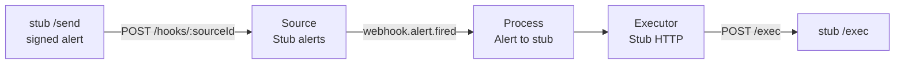

# Quick start

Ten minutes from a clean machine to a webhook starting an HTTP call. You need Docker with Compose
and nothing else: no external account, because the Compose stack includes a stub server that
plays both ends.

What you will build:



## 1. Start the stack

```bash
git clone https://github.com/ai-switchboard/switchboard.git && cd switchboard
docker compose -f deploy/docker-compose.yml --profile stub up -d
```

This starts three containers:

| Service       | URL from your machine   | URL inside Compose        | What it is                                                   |
| ------------- | ----------------------- | ------------------------- | ------------------------------------------------------------ |
| `postgres`    | —                       | `postgres:5432`           | Postgres 17, the only state                                  |
| `switchboard` | <http://localhost:8080> | `http://switchboard:8080` | The server and UI, in evaluation mode                        |
| `stub`        | <http://localhost:9090> | `http://stub:9090`        | Webhook sender, `http` executor target and fake Routines API |

The Compose file sets `SWITCHBOARD_EVALUATION=true`, `WEBHOOK_SECRET=change-me-webhook-secret`
and `STUB_CALLBACK_SECRET=change-me-callback-secret`. The two secrets are read through the `env`
secret provider as `secret://env/WEBHOOK_SECRET` and `secret://env/STUB_CALLBACK_SECRET`.

Wait until the server is ready:

```bash
curl -fsS http://localhost:8080/readyz && echo ready
```

## 2. Sign in

The first start creates a local admin and prints a temporary password once:

```bash
docker compose -f deploy/docker-compose.yml logs switchboard | grep -i password
```

Open <http://localhost:8080> and sign in with that email and password. Because the password is
temporary, Switchboard asks you to choose your own right away (at least 8 characters, not your
email); after that you land on the Board. You can change it again any time from **Settings ›
Account**, and add people with their own temporary passwords in **Settings › Users**. The amber
evaluation banner stays until you configure an issuer ([configuration](configuration.md)).
The Board is empty and shows a three-step guide: add a source, add an executor, draw a process.

**Locked out?** The local admin's email is `admin@switchboard.local` unless
`SWITCHBOARD_BOOTSTRAP_ADMIN` names another (in evaluation mode the sign-in page's **Forgot
password or email?** panel shows it). Switchboard sends no email, so recovery runs on the server,
with its database access instead of a sign-in:

```bash
docker compose -f deploy/docker-compose.yml exec switchboard switchboard users list
docker compose -f deploy/docker-compose.yml exec switchboard \
  switchboard users reset-password admin@switchboard.local
```

`reset-password` prints a new temporary password once, signs the account out everywhere and
writes the audit log; you choose your own password at the next sign-in. Other people can simply
ask an admin to reset theirs in **Settings › Users** ([runbook](runbook.md#locked-out)).

## 3. Add a webhook source

**Sources → New source → Webhook.**

- **Name:** `Stub alerts`
- **Verification:** `hmac`, **Secret:** `secret://env/WEBHOOK_SECRET`. Keep the defaults for the
  signature header (`x-signature-256`), prefix (`sha256=`), algorithm (`sha256`) and encoding
  (`hex`). These match what the stub sends.
- **Event types:** add `webhook.alert.fired`, title `Alert fired`, with three string attributes:
  `service`, `severity`, `message`.
- **Mapping** (JSONata over `{ body, headers, query }`):

  ```jsonata
  {
    "type": "webhook.alert.fired",
    "artifact": { "kind": "alert", "id": body.id },
    "attributes": { "service": body.service, "severity": body.severity, "message": body.message },
    "occurredAt": body.occurredAt
  }
  ```

Save with a reason such as `quick start`. Every change asks for a one-line reason and is written
to the audit log. The source page now shows its webhook URL, `http://localhost:8080/hooks/<sourceId>`.
Copy the `<sourceId>`.

## 4. Add an HTTP executor

**Executors → New executor → HTTP.**

- **Name:** `Stub HTTP`
- **Base URL:** `http://stub:9090`
- **Usage dimensions:** keep `duration_seconds` and `response_bytes`, and add
  `cost_usd` (unit `usd`, aggregate `sum`, budgetable). The stub reports a cost on every call.

Save with a reason.

## 5. Draw the process

**Processes → New process**, name `Alert to stub`.

1. **Triggers → Add trigger.** Pick `Stub alerts`, tick `webhook.alert.fired`, and set the
   filter to `attributes.severity = 'critical'`. The editor shows the declared attributes and
   evaluates the filter against the last 20 real events once there are some. Accept or write the
   describe sentence: _A critical alert fired_.
2. **Batching.** Debounce 5 seconds, max size 20, max age 60 seconds.
3. **Budgets.** Runs per hour 30, runs per day 200, `cost_usd` per day 5.
4. **Executor.** Pick `Stub HTTP`. Target: method `POST`, URL `/exec`, tracking `sync`, usage
   expression `{ "cost_usd": response.body.usage.cost_usd }`. Input mapping:

   ```jsonata
   { "mode": mode, "runId": run.id, "alerts": events.{ "id": artifact.id, "service": attributes.service } }
   ```

   The preview validates the produced input against the executor's input schema.

5. Turn the process on and **Save** with a reason.

The Board now shows `Stub alerts` → `Alert to stub` → `Stub HTTP`.

## 6. Send a test event

The stub's `/send` signs a sample alert with the secret you give it and posts it to the target.
The target is resolved inside Compose, so use the `switchboard` hostname:

```bash
curl -X POST "http://localhost:9090/send?target=http://switchboard:8080/hooks/<sourceId>&secret=change-me-webhook-secret"
```

The sample body is `{ id, type: "alert.fired", service, severity, message, occurredAt }` with
`severity: critical` by default. Add `&severity=warning` to send one that does not match the
filter: it is recorded as an event and its trace shows the filter evaluating to false.

You can also press **Send test event** on the source page.

## 7. Watch the run

Open **Activity**. The event's stage indicator walks received → matched → batched → gated →
invoking → ok within a few seconds (the debounce is 5 s). Click the row for the trace: the filter
decision with the expression and its result, the batch opening and closing, each gate check, the
budget check with the binding limits, the invoke with the stub's response, and the usage the
run reported (`cost_usd`, `duration_seconds`, `response_bytes`).

Check the stub saw the call:

```bash
curl -s http://localhost:9090/requests | head -c 2000
```

## 8. Try the rest

- **Redelivery collapses:** send the same delivery twice (`curl` the stub's `/requests` for the
  body, or use _Replay_ on the event page). The second one is `deduped` for this process.
- **A burst coalesces:** `curl -X POST "http://localhost:9090/burst?n=200&keys=3&target=http://switchboard:8080/hooks/<sourceId>&secret=change-me-webhook-secret"`.
  The debounce turns 200 events into a handful of runs, and the source caps drop anything beyond
  `eventCapPerHour`.
- **Throttled:** set runs per hour to 1 and send two alerts a minute apart. The second batch is
  `throttled` with the binding limit named, and nothing is re-queued.
- **Callback tracking:** set the executor's callback secret to `secret://env/STUB_CALLBACK_SECRET`
  and change the target URL to `/exec/callback` with tracking `callback`. The stub answers 202
  and posts a signed callback to `/callbacks/<executorId>` half a second later.

## The stub server

`deploy/stub/server.js` is a dependency-free Node server (`node deploy/stub/server.js`, port
`STUB_PORT`, default 9090) used by this quick start and the integration tests:

| Endpoint                                       | What it does                                                                                                                                                                                                                                                                        |
| ---------------------------------------------- | ----------------------------------------------------------------------------------------------------------------------------------------------------------------------------------------------------------------------------------------------------------------------------------- |
| `POST /exec`                                   | `http` executor target: 200 `{ ok: true, echo, usage: { cost_usd } }`. `?status=`, `?latency=` (ms), `?cost=`, or headers `x-stub-status`, `x-stub-latency-ms`                                                                                                                      |
| `POST /exec/callback`                          | Answers 202, then after `?delay=` ms (default 500) POSTs `{ runId, externalId, status, errors?, usage: { cost_usd }, finishedAt }` to the `x-switchboard-callback-url` header, signed `x-switchboard-signature: sha256=<hex>` with `STUB_CALLBACK_SECRET`. `?outcome=error` to fail |
| `POST /send?target=&secret=`                   | Signs a sample alert (`x-signature-256: sha256=<hex>`) and posts it to `target`                                                                                                                                                                                                     |
| `POST /burst?n=500&keys=5&target=&secret=`     | Posts `n` alerts spread across `keys` services                                                                                                                                                                                                                                      |
| `POST /v1/claude_code/routines/:id/fire`       | Fake Claude Routines: `{ id, session_url }`, or 429 with `retry-after` when `STUB_ROUTINES_429=1` or every Nth call (`STUB_ROUTINES_429_EVERY`)                                                                                                                                     |
| `GET /api/oauth/usage`, `POST /v1/oauth/token` | Fake Routines usage windows (`five_hour`, `seven_day`) and OAuth tokens                                                                                                                                                                                                             |
| `POST /stub/config`                            | Change the 429 behaviour and usage figures at run time                                                                                                                                                                                                                              |
| `GET /requests`, `DELETE /requests`            | Every request the stub received; reset                                                                                                                                                                                                                                              |

## The same thing as a file

Everything above is in [examples/webhook-to-http.yaml](../examples/webhook-to-http.yaml). Create
an API token (**Settings → API tokens**, role admin), then:

```bash
docker compose -f deploy/docker-compose.yml exec -T \
  -e SWITCHBOARD_TOKEN=<token> switchboard \
  switchboard apply -f /dev/stdin --reason "quick start" < examples/webhook-to-http.yaml
```

or, with the CLI installed locally (`npm install -g @ai-switchboard/cli`):

```bash
export SWITCHBOARD_URL=http://localhost:8080 SWITCHBOARD_TOKEN=<token>
switchboard apply -f examples/webhook-to-http.yaml --dry-run --reason "quick start"
switchboard apply -f examples/webhook-to-http.yaml --reason "quick start"
```

## Clean up

```bash
docker compose -f deploy/docker-compose.yml --profile stub down -v
```

`-v` removes the Postgres volume too.

Next: [Concepts](concepts.md) for the vocabulary, [Configuration](configuration.md) for OIDC and
the YAML format, and the [runbook](runbook.md) for operating it.
