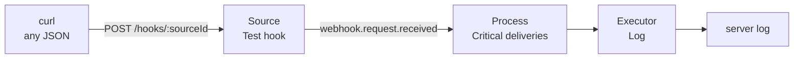

# Quick start

Ten minutes from a clean machine to a webhook starting a run. You need Docker with Compose and
nothing else: no external account and no mapping to write. The built-in **log executor** stands in
for a real backend and writes every run to the server log.

What you will build:



## 1. Start the stack

```bash
git clone https://github.com/ai-switchboard/switchboard.git && cd switchboard
docker compose -f deploy/docker-compose.yml up -d --build
```

This starts two containers: `postgres` (the only state) and `switchboard` (the server and UI at
<http://localhost:8080>, in evaluation mode). Wait until it is ready:

```bash
curl -fsS http://localhost:8080/readyz && echo ready
```

## 2. Sign in

The first start creates a local admin, `admin@switchboard.local`, and prints a temporary password
once:

```bash
docker compose -f deploy/docker-compose.yml logs switchboard | grep -i password
```

Open <http://localhost:8080>, sign in, and choose your own password (at least 8 characters, not
your email). You land on the Board, which is empty and shows a three-step guide. The amber banner
reminds you that OIDC is not configured; that is expected for an evaluation install.

**Locked out?** Switchboard sends no email, so recovery runs on the server:

```bash
docker compose -f deploy/docker-compose.yml exec switchboard switchboard users list
docker compose -f deploy/docker-compose.yml exec switchboard \
  switchboard users reset-password admin@switchboard.local
```

`reset-password` prints a new temporary password once ([runbook](runbook.md#locked-out)).

**Tired of typing reasons?** Every change asks for a one-line reason for the audit log. For a
local install you can turn that off in **Settings › General › Require a reason for every change**.

## 3. Add a webhook source

**Sources → Add source → Webhook.**

- **Name:** `Test hook`
- **Verification:** _None — accept unauthenticated deliveries (evaluation only)_. The red warning
  is the point: anyone with the URL can send events. Use HMAC or a shared secret for anything real.
- **How deliveries become events:** _Quick_ (the default). No mapping to write: every delivery becomes one
  `webhook.request.received` event, and the body's top-level fields become its attributes. Nested
  objects are flattened one level, so `{"deployment": {"env": "prod"}}` becomes the attribute
  `deployment_env`.
- **Artifact id path:** `body.id`. This is the field the artifact (the thing the event is about)
  is identified by, and what you search for in the trace.

Try it before saving: paste a sample into **Try it with a sample delivery**, for example

```json
{ "id": 1, "title": "Deploy failed", "service": "checkout", "severity": "critical" }
```

and the panel shows the event it produces: type, artifact `1`, and attributes `id`, `title`,
`service` and `severity`.

Save. The source page shows its webhook URL, `http://localhost:8080/hooks/<sourceId>`.

## 4. Add the log executor

**Executors → Add executor → Log (test executor).**

- **Name:** `Log`
- Keep the defaults. Optionally set **Simulated hourly limit** to `20` to get an "Hourly runs"
  meter you can put ceilings on later.

Save.

## 5. Draw the process

**Processes → New process.**

1. **Basics.** Name it `Critical deliveries`. **Enabled** is on.
2. **Triggers → Add trigger.** Pick `Test hook` and tick `webhook.request.received`. Set the filter
   to `attributes.severity = 'critical'` (the editor completes attribute names). Once events
   exist, the editor shows the filter's result on the last 20 of them.
3. **Batching.** Debounce 5 seconds is fine.
4. **Executor.** Pick `Log`. Target: label `quick-start`, outcome `ok`. Keep the default input
   mapping; the preview shows what the executor will receive.
5. **Save.**

The Board now shows `Test hook` → `Critical deliveries` → `Log`.

## 6. Send an event

Post any JSON to the webhook URL:

```bash
curl -X POST http://localhost:8080/hooks/<sourceId> \
  -H 'content-type: application/json' \
  -d '{"id": 1, "title": "Deploy failed", "service": "checkout", "severity": "critical"}'
```

Or press **Send test event** on the source page: the banner says which processes took it and
links to its trace.

## 7. Watch the run

Open **Activity**. Within a few seconds (the debounce is 5 s) the event's indicator walks
received → matched → batched → gated → invoked → ok. Click it for the trace: the filter decision
with its expression, the batch, each gate check, the budget check, the invoke and the result.

The log executor wrote the run to the server log:

```bash
docker compose -f deploy/docker-compose.yml logs switchboard | grep "log executor"
```

## 8. Try the rest

- **Why nothing ran:** send `"severity": "warning"`. Activity shows it as not taken, and its
  trace says `filter false: attributes.severity = 'critical'`. Disable the process and send
  another: the trace says `process is disabled`.
- **Redelivery collapses:** send the same body twice. The second one is `deduped` for the process.
- **A burst coalesces:** send ten events within five seconds. The debounce turns them into one run.
- **Throttled:** set **Budgets › Runs per hour** to 1 and send two events a minute apart. The
  second batch is `throttled`, with the binding limit named.
- **Failures:** set the executor target's **Simulated outcome** to `error` and send three events.
  The breaker opens after the threshold and the Board shows it under **Needs attention** with a
  Reset button. `rate_limited` opens a soft-hold on the executor instead; `delayMs` shows a run in
  flight.
- **Meters:** with a simulated hourly limit, the top bar shows the "Hourly runs" gauge filling up,
  and a meter ceiling in the process's budgets throttles event runs above it.

## The same thing as a file

Everything above is in [examples/log-executor.yaml](../examples/log-executor.yaml). Create an API
token (**Settings › API tokens**, role admin), then:

```bash
docker compose -f deploy/docker-compose.yml exec -T \
  -e SWITCHBOARD_TOKEN=<token> switchboard \
  switchboard apply -f /dev/stdin --reason "quick start" < examples/log-executor.yaml
```

## Going further: signed webhooks and a real HTTP call

The Compose file has an optional `stub` service: a small fake "outside world" used by the
integration and end-to-end tests. Start it only when you want to try what the log executor can't
show:

```bash
docker compose -f deploy/docker-compose.yml --profile stub up -d
```

It listens on <http://localhost:9090> (`http://stub:9090` inside Compose) and offers:

| Endpoint                                       | What it does                                                                                                                     |
| ---------------------------------------------- | -------------------------------------------------------------------------------------------------------------------------------- |
| `POST /send?target=&secret=`                   | Signs a sample alert (`x-signature-256: sha256=<hex>`) and posts it to `target`: try a webhook source with **HMAC** verification |
| `POST /burst?n=500&keys=5&target=&secret=`     | Posts `n` signed alerts spread across `keys` services                                                                            |
| `POST /exec`                                   | An endpoint for the **HTTP** executor: 200 `{ ok, echo, usage: { cost_usd } }`; `?status=`, `?latency=` (ms), `?cost=`           |
| `POST /exec/callback`                          | Answers 202, then posts a signed callback to `x-switchboard-callback-url`: try **callback** tracking (`?outcome=error` to fail)  |
| `GET /meter`                                   | `{ used, limit, resetsAt }` for the HTTP executor's meter endpoint                                                               |
| `POST /v1/claude_code/routines/:id/fire`       | A fake Claude Routines API, including 429 rate limits (`STUB_ROUTINES_429=1`)                                                    |
| `GET /api/oauth/usage`, `POST /v1/oauth/token` | Fake Routines usage windows and OAuth tokens                                                                                     |
| `GET /requests`, `DELETE /requests`            | Every request the stub received; reset                                                                                           |

The Compose file sets `WEBHOOK_SECRET=change-me-webhook-secret` and
`STUB_CALLBACK_SECRET=change-me-callback-secret` for the server, read as
`secret://env/WEBHOOK_SECRET` and `secret://env/STUB_CALLBACK_SECRET`.
[examples/webhook-to-http.yaml](../examples/webhook-to-http.yaml) wires an HMAC-verified webhook to
the stub's `/exec`; send it a signed alert with

```bash
curl -X POST "http://localhost:9090/send?target=http://switchboard:8080/hooks/<sourceId>&secret=change-me-webhook-secret"
```

## Clean up

```bash
docker compose -f deploy/docker-compose.yml --profile stub down -v
```

`-v` removes the Postgres volume too (`--profile stub` also stops the stub if you started it).

Next: [Concepts](concepts.md) for the vocabulary, [Configuration](configuration.md) for OIDC and
the YAML format, and the [runbook](runbook.md) for operating it.
