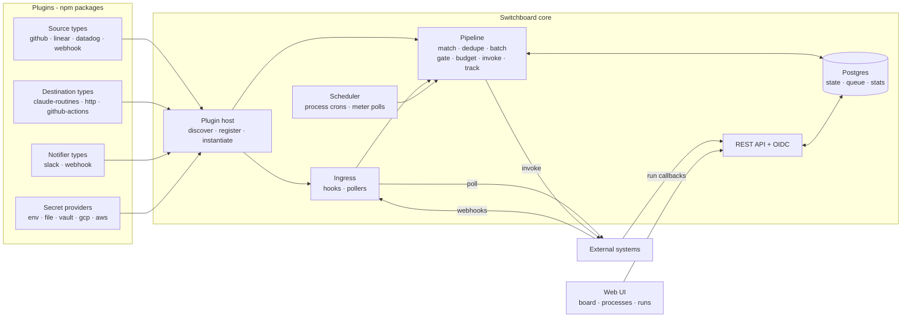
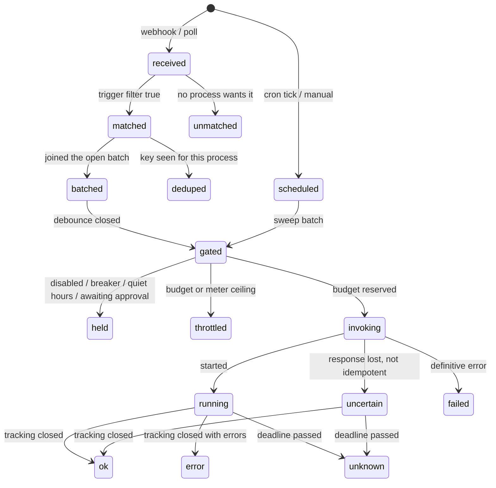

# AI Switchboard — Technical Design

2026-09-27 · @Ilya

_Destination: called "executor" in earlier drafts (and before SDK 2.0.0)._

## Summary

AI Switchboard ("Switchboard" from here on; npm scope `@ai-switchboard`, CLI `switchboard`) is an open-source service that turns events from the systems a team already runs into controlled invocations of the automations they already have. It listens to sources (GitHub, Linear, Datadog, any webhook), lets a person wire event types to processes in a UI, and starts each process through a destination (a Claude Routine, an HTTP endpoint, a GitHub Actions workflow) under budgets, schedules and approval gates the same UI controls.

Three things are fixed and everything else is a plugin. The **event envelope** is one shape every source produces. The **dispatch pipeline** — match, dedupe, batch, gate, budget, invoke, track — is one path every event and every schedule tick walks. The **process** is one configuration object a person edits in the UI: which events, what filter, how to batch, which destination, what input to send, when to sweep on a schedule. Sources, destinations, notifiers and secret providers are npm packages; installing one registers it, and its event types, settings forms and meters appear in the UI without a line of code in the core.

The design is committed to a small stack: Node 22 and TypeScript, Postgres as the only store, one container, plugins loaded in-process from npm, JSONata as the single expression language for filters and input mapping, OpenTelemetry for signals, OIDC for sign-in. A first-time user runs one `docker compose up`, installs two plugins, wires an event to a process on a canvas, and watches the first run happen.

## Goals and non-goals

Switchboard succeeds if a team can connect a new event source or a new execution backend by installing a package, and can express every rule about when and how often something runs without writing code.

**Goals**

- Pluggable sources and destinations with stable, versioned TypeScript interfaces; a plugin is an npm package that self-registers on install and is configured entirely from the UI.

- Processes are data, not code: triggers, filters, batching, budgets, schedules, destination binding and input mapping are all edited in the UI and stored in Postgres, with an audit trail.

- One pipeline for everything: an event, a schedule tick and a manual start pass the same gates, budgets and records, so there is one place to look when something did or did not run.

- Budgets that understand the backend: a destination can expose meters (rolling usage windows, daily allowances) and the pipeline enforces headroom against them, because the most useful destinations are metered subscriptions.

- Every decision is observable: one structured log line and one metric per pipeline stage through OpenTelemetry, plus built-in statistics the UI renders without any external system.

- A UI a person can operate from: a visual board of sources, processes and destinations; a trace for any event; budgets and meters as pictures; approvals in a queue.

- Small operational footprint: one container plus Postgres; a Helm chart and a Compose file; a CLI for plugin management and headless configuration.

**Non-goals**

- Being a workflow engine. A process is one hop: events in, one invocation out. Multi-step orchestration belongs to the destination's own system (a Routine, a Temporal workflow, a pipeline); Switchboard decides _whether and when_, not _how_.

- Running user code in the core. Filters and mappings are expressions, not scripts; anything needing code is a plugin.

- Being a source of truth for the systems it watches. Payloads carry references; the executed process re-reads real state.

- Multi-tenancy. One installation serves one organisation; teams within it are separated by roles, not tenants.

- Sandboxing plugins. Plugins run in-process as trusted code, like a Grafana or Backstage backend plugin; trust is managed at install time, not at runtime.

## Background

Switchboard began as an internal dispatcher for a set of development-automation loops: watch Linear and GitHub, fire a Claude Routine when a label changes, keep the fleet under the account's daily run allowance. Building it exposed a shape that is not specific to that team at all: a handful of systems emit events, a handful of backends can run work, and the hard part in between is policy — dedupe, batching, budgets, quiet hours, approvals — plus the visibility to know what happened. Every team automating with metered AI runtimes, CI systems or internal jobs rebuilds that middle badly.

The generic version keeps the middle and moves both ends behind interfaces. It also keeps three lessons from the first version. Metered backends are the norm, not the exception: a Claude Routine seat has a daily run allowance and rolling usage windows, and a dispatcher that cannot see them will burn them; so destinations expose meters and the pipeline enforces headroom. Invocation APIs are often not idempotent, so the pipeline never retries a request that may have succeeded and instead tracks the run to closure. And the only trustworthy payload is a reference: the process being started re-reads real state, so a forged webhook or leaked token can waste budget but cannot direct work.

## Concepts and vocabulary

Ten nouns cover the whole system; the UI, the API, the SDK and this document use them and no synonyms.

| Term            | Meaning                                                                                                                                                                                    | Where it comes from                                            |
| --------------- | ------------------------------------------------------------------------------------------------------------------------------------------------------------------------------------------ | -------------------------------------------------------------- |
| **Plugin**      | An npm package that contributes one or more source types, destination types, notifier types or secret-provider types                                                                       | Installed by an admin                                          |
| **Source**      | An _instance_ of a source type, configured with credentials and settings: "GitHub — acme org", "Datadog — prod". A source emits events                                                     | Created in the UI from an installed source type                |
| **Event**       | One normalised occurrence from a source: a type, a time, the artifact it is about, flat attributes, a dedupe key                                                                           | Produced by a source's `parse` or `poll`                       |
| **Process**     | A user-defined unit of automation: triggers, filter, batching, gates, budgets, schedules, a destination binding and an input mapping                                                       | Created in the UI                                              |
| **Trigger**     | One subscription inside a process: a source, one or more event types, a filter expression                                                                                                  | Part of a process                                              |
| **Destination** | An _instance_ of a destination type, configured with credentials: "Claude Routines — loops seat", "GitHub Actions — acme org". It invokes work, tracks runs and reports what they consumed | Created in the UI from an installed destination type           |
| **Run**         | One invocation of a process through its destination, from the moment budget is reserved to a terminal status, with the destination's external reference (a session URL, a workflow run id) | Produced by the pipeline                                       |
| **Usage**       | What one run consumed, in dimensions the destination type declares (tokens, billable minutes, dollars, seconds), reported by the destination plugin and budgetable per process             | Declared by destination types, reported per run                |
| **Meter**       | A gauge a destination exposes about its remaining capacity: a rolling usage window, a daily allowance, a spend counter, with a reset time                                                  | Declared by destination types, read per instance on a schedule |
| **Action**      | A side effect a source or destination can perform on request (add a label, mark ready, post a comment), usable as a step before or after a run                                             | Declared by plugins                                            |

Two more words name pipeline outcomes and are used only for that: a batch is **held** when a gate stops it (disabled, breaker, quiet hours, awaiting approval) and **throttled** when a budget or meter ceiling stops it. Neither is a failure; both leave the work for the process's next scheduled sweep.

## Architecture overview

One Node process hosts the HTTP server, the plugin host, the pipeline worker and the UI; Postgres holds every piece of state and doubles as the job queue; plugins are ordinary npm packages loaded at boot. Two or more replicas run safely because all coordination goes through Postgres.



Plugins contribute types; the host instantiates them from stored settings; ingress and the scheduler feed the pipeline; the pipeline reads and writes Postgres and calls destinations; the API serves the UI and receives run callbacks.

**Components**

| Component          | Responsibility                                                                                                                                                                                          |
| ------------------ | ------------------------------------------------------------------------------------------------------------------------------------------------------------------------------------------------------- |
| Plugin host        | Discovers installed plugin packages, validates their manifests against the SDK version, registers their types, and creates one live object per configured instance with its resolved secrets            |
| Ingress            | One route per push source instance (`/hooks/<instanceId>`); verifies, stores the raw delivery, parses, acks in under a second, enqueues. One poller per pull source instance with a persisted watermark |
| Scheduler          | Owns every process's sweep crons and every destination's meter polling; built on the Postgres job queue so ticks survive restarts and run exactly once across replicas                                  |
| Pipeline           | The seven stages, each a transactional step over Postgres rows; runs as queue jobs so any replica can process any step                                                                                  |
| Expression engine  | JSONata with a fixed function library (`$resolve`, `$linked`, `$secret` denied, `$now`); evaluates trigger filters, batch keys, input mappings and notification templates with a time and memory limit  |
| Destination bridge | Calls `invoke` with the mapped input, records the run, drives tracking (sync result, polling, or callback), and updates meters                                                                          |
| REST API           | Everything the UI does; OIDC sign-in; run callback endpoints; a JSON export/import of the whole configuration                                                                                           |
| Web UI             | React single-page app served by the same process                                                                                                                                                        |
| Postgres           | Configuration, events, runs, statistics, audit, and the job queue (pg-boss), in one database                                                                                                            |

**Runtime and libraries**, decided: Node 22 LTS, TypeScript, Fastify for HTTP, Drizzle for typed SQL and migrations, pg-boss for jobs and crons on Postgres, JSONata for expressions, Ajv for JSON Schema validation, OpenTelemetry SDK for signals, React + Vite for the UI with React Flow for the board and a JSON-Schema form renderer for plugin settings.

**Deployment shape.** One image, `ghcr.io/ai-switchboard/switchboard`, with the reference plugins baked in; additional plugins are added by a `SWITCHBOARD_PLUGINS` build argument or by mounting a plugins directory. `docker compose up` starts the image and Postgres for evaluation; the Helm chart runs N replicas behind an ingress with Postgres supplied by the operator. Replicas are identical; the job queue makes them cooperate. Secrets never live in Postgres: settings store `secret://<provider>/<name>` references and a secret-provider plugin resolves them at instantiation.

## Plugin system

A plugin is an npm package with a `switchboard` field in its `package.json` and a default export built with `definePlugin()` from `@ai-switchboard/sdk`; installing it is registering it, and everything the UI needs to configure it comes from the manifest the export returns.

**Package format**

```json
{
  "name": "@acme/switchboard-source-jira",
  "version": "1.2.0",
  "keywords": ["switchboard-plugin"],
  "switchboard": { "entry": "./dist/plugin.js", "sdk": "^2.0.0" },
  "peerDependencies": { "@ai-switchboard/sdk": "^2.0.0" }
}
```

```typescript
import { definePlugin } from '@ai-switchboard/sdk';
export default definePlugin({
  id: 'acme-jira', // globally unique, kebab-case
  displayName: 'Jira',
  sources: [jiraSourceType], // SourceType[]
  destinations: [], // DestinationType[]
  notifiers: [], // NotifierType[]
  secretProviders: [], // SecretProviderType[]
  capabilities: { network: ['*.atlassian.net'], secrets: ['api-token'] },
});
```

**Discovery and registration.** At boot the plugin host scans two places: the image's `node_modules` and `$SWITCHBOARD_HOME/plugins/node_modules`, looking for packages whose `package.json` carries the `switchboard` field. For each it checks the declared `sdk` range against the running SDK version, dynamically imports the entry, validates the manifest (unique ids, well-formed JSON Schemas for every settings and event type, semver), and upserts a `plugin_types` row per contributed type with the manifest content. A type that was present last boot and is missing now is marked `unavailable`; its instances stay configured but are shown as needing the plugin back, and their processes are held. Nothing about registration requires a database migration or a restart of anything but the process itself.

**Installing.** `switchboard plugins add @acme/switchboard-source-jira@^1` runs `npm install` into `$SWITCHBOARD_HOME/plugins`, records the exact version and integrity hash in `plugins.lock.json`, and prints the manifest's declared capabilities for the admin to see before the host loads it on the next start. The same command is available from the UI's Plugins page for admins, and the image can pre-bake plugins through the `SWITCHBOARD_PLUGINS` build argument so production deploys need no runtime install. `switchboard plugins remove` and `switchboard plugins list` complete the set. Private registries work through the ordinary `.npmrc`.

**Types versus instances.** A plugin contributes _types_; a person creates _instances_ of them in the UI. A source type `github` becomes the instance "GitHub — acme org" with its own credentials, webhook secret and settings; a destination type `claude-routines` becomes "Claude Routines — automation seat". Instances are rows; the host builds one live object per enabled instance by resolving its `secret://` references and calling the type's `create(settings)`. A settings change re-creates the object; nothing else restarts.

**Settings forms.** Every type declares `settingsSchema` as JSON Schema (draft 2020-12) with a small set of UI annotations (`x-secret` marks a field that holds a secret reference, `x-widget` picks a control, `x-group` groups fields). The UI renders the form from the schema, so a plugin author never writes UI. Destination types additionally declare `targetSchema` (what a process must supply to name _what_ to run) and `inputSchema` (the shape the input mapping must produce); source types declare one JSON Schema per event type's `attributes`.

**SDK.** `@ai-switchboard/sdk` exports the interfaces below, `definePlugin`, a typed `Logger`, an `HttpClient` that honours the declared network capability and adds tracing, a `verifyHmac` helper, and a test kit (`@ai-switchboard/sdk/testing`) that runs the conformance suite in the Testing section against a plugin's fixtures. The SDK follows semver strictly: additive fields are minors, any change to an interface method is a major, and the host loads any plugin whose declared range includes the running major.

**Trust.** Plugins run in the core's process with its privileges; that is the same model as Grafana backend plugins and Backstage, and it is stated plainly in the docs. The controls are at install time: only admins install; the lockfile pins version and integrity; the manifest's `capabilities` (network hosts, secret names) are displayed on install and enforced for the SDK's `HttpClient` and secret resolution (a plugin using raw `fetch` bypasses the network check, which the docs say too). A curated list of reviewed plugins is published on the project site; anything else is at the installer's discretion.

## Event model

Every source produces the same `Event`; the raw delivery is kept for replay and debugging but nothing downstream reads it, and every attribute a filter may touch is declared in the source type's JSON Schema so the UI can offer it by name.

```typescript
interface Event {
  id: string; // uuid, assigned by the core
  sourceId: string; // the source instance
  sourceType: string; // 'github'
  type: string; // '<sourceType>.<object>.<verb>', e.g. 'github.pr.labeled'
  occurredAt: string; // ISO-8601, from the source when it has one
  receivedAt: string; // ISO-8601, core clock
  artifact: ArtifactRef; // the durable thing this event is about
  attributes: Attributes; // flat facts, validated against the declared schema
  dedupeKey: string; // stable for the same change delivered twice
  deliveryId?: string; // the source's own delivery id when it has one
  rawRef: string; // pointer to the stored raw body
}

interface ArtifactRef {
  kind: string; // 'github.pr' | 'linear.issue' | 'datadog.monitor' | ...
  id: string; // '482' | 'LOL-1712' | '<monitor id>'
  url?: string;
  version?: string; // source updated-at or etag; part of the dedupe key
}

type Attributes = Record<string, string | number | boolean | string[]>;

interface EventTypeSpec {
  type: string; // 'github.pr.labeled'
  title: string; // 'Pull request labeled'
  description: string;
  attributes: JSONSchema; // object schema, flat properties only
  examples: Attributes[]; // shown in the UI's filter editor
}
```

**Declared, not discovered.** A source type lists its `EventTypeSpec`s in its manifest. The core validates every parsed event against its declared schema and rejects a plugin's event that does not conform (logged as `event_invalid`, counted against the plugin, never delivered), so a filter written against the documented attributes cannot be broken by an undocumented change. The generic `webhook` source is the one exception by design: the person defines its event types and attribute mapping in the UI when they create the instance, and the core stores that definition as the schema.

**Dedupe key.** Computed by the source as `${type}:${artifact.kind}:${artifact.id}:${artifact.version ?? deliveryId}`. Where the source system carries an object version (GitHub and Linear `updatedAt`), a redelivered webhook collapses and a new change does not; where it does not (a monitor alert), the source's alert-cycle id stands in; for polled sources the watermark guarantees single emission. The key is scoped per process at match time, so two processes subscribing to the same event each run once.

**Raw bodies** are stored for 30 days keyed by `rawRef`, with headers, and are what the UI's _Replay_ re-injects through the same `parse`; replayed events carry `replayOf` so a trace distinguishes them.

## Source interface

A source type turns one external system into `Event`s and, optionally, performs actions on it and answers live-state questions for filters. It is the only place system-specific code lives on the ingress side.

```typescript
interface SourceType {
  id: string; // 'github'
  displayName: string;
  mode: 'push' | 'pull' | 'both';
  settingsSchema: JSONSchema; // per instance: credentials refs, org, filters
  eventTypes: EventTypeSpec[];
  actions?: ActionSpec[]; // e.g. { id: 'addLabel', argsSchema, describe }
  create(settings: Settings, ctx: PluginContext): Source; // one live object per instance
}

interface Source {
  // push
  verify?(req: RawRequest): VerifyResult; // signature / shared secret, before parse
  parse?(req: RawRequest): Event[]; // one delivery -> 0..n events, pure
  provision?(webhookUrl: string): Promise<ProvisionResult>; // register the webhook via the system's API
  // pull
  poll?(watermark: string | null): Promise<{ events: Event[]; watermark: string }>;
  // shared
  resolve?(ref: ArtifactRef): Promise<ArtifactSnapshot>; // live state for filters and mappings
  linked?(ref: ArtifactRef): Promise<ArtifactRef[]>; // e.g. PR -> its tracker issue
  act?(action: string, args: unknown): Promise<ActionResult>;
  health(): Promise<Health>;
}
```

**Lifecycle.** An instance is created in the UI from a type; the host resolves its secrets and calls `create`. A push instance gets `/hooks/<instanceId>`; if the type implements `provision`, the UI offers _Register webhook_ and the source creates it in the external system with the right secret and event subscriptions, which removes the most error-prone manual step. A pull instance gets a queue job at its `pollIntervalSeconds` with the watermark stored per instance. Disabling an instance keeps its route answering 200 (so the external system does not enter retry storms) while events are stored with `stage=source_disabled`.

**Contract.** `verify` rejects before `parse` runs and never trusts a body it has not authenticated. `parse` is pure and deterministic. Events conform to the declared schemas. `resolve` reads live state, never a cache, because the filters that need it ("is the linked issue still tagged X") are the ones a stale answer breaks. No attribute contains a secret or a raw body. The conformance kit enforces all of this.

**Per-instance settings the core adds** to every source, outside the plugin's own schema: `enabled`, `eventCapPerHour` / `eventCapPerDay` (flood control at the door), `eventTypesEnabled[]` (mute a type), `pollIntervalSeconds` for pull types.

**Reference sources** shipped in the repository:

| Type        | Mode | Verify                                                                                                     | Notes                                                                                                                                                                                                                                             |
| ----------- | ---- | ---------------------------------------------------------------------------------------------------------- | ------------------------------------------------------------------------------------------------------------------------------------------------------------------------------------------------------------------------------------------------- |
| `webhook`   | push | HMAC-SHA256 over the body with a per-instance secret, or a shared-secret header, or none (evaluation only) | The universal adapter: the person names event types and writes a JSONata mapping from body to `type`, `artifact` and `attributes` in the UI; covers any system without writing a plugin                                                           |
| `poll-http` | pull | —                                                                                                          | Polls a JSON endpoint with a cursor or timestamp parameter and maps items with JSONata; the pull twin of `webhook`                                                                                                                                |
| `github`    | push | `X-Hub-Signature-256`                                                                                      | GitHub App or repository webhook; `provision` creates the webhook; events for pull requests, issues, check suites, releases, pushes; `linked` resolves tracker references in PR bodies; actions `addLabel`, `removeLabel`, `markReady`, `comment` |
| `linear`    | push | `Linear-Signature` HMAC and `webhookTimestamp` within 60 s                                                 | Label and state changes derived from `updatedFrom`; actions `addLabel`, `setState`, `comment`                                                                                                                                                     |
| `datadog`   | push | Shared-secret custom header                                                                                | JSON payload template with `$ALERT_ID`, `$ALERT_CYCLE_KEY`, `$ALERT_TRANSITION`, `$ALERT_TYPE`, `$PRIORITY`, `$TAGS`; acks before processing because Datadog times out at 15 s and retries only on 5xx                                            |

Braintrust, Sentry, PagerDuty, Jira and Slack are the next community targets; each is a directory in the `plugins/` workspace following the same template.

## Destination interface

A destination type knows how to start work in one backend, how to find out whether it finished, and how much of the backend's capacity is left. The pipeline never knows what a Routine or a workflow is; it knows `invoke`, a run status, and meters.

```typescript
interface DestinationType {
  id: string; // 'claude-routines'
  displayName: string;
  settingsSchema: JSONSchema; // per instance: account credentials, base URL
  targetSchema: JSONSchema; // per process: what to run (routine id, workflow file, URL)
  inputSchema: JSONSchema; // what the process's input mapping must produce
  tracking: 'sync' | 'poll' | 'callback' | 'none';
  idempotentInvoke: boolean; // may the core retry an invoke whose response was lost?
  usage: UsageDimension[]; // what this backend reports per run (may be empty)
  meters?: MeterSpec[]; // what this backend reports about its remaining capacity
  actions?: ActionSpec[];
  create(settings: Settings, ctx: PluginContext): Destination;
}

interface Destination {
  invoke(target: Target, input: Input, run: RunHandle): Promise<InvokeResult>;
  poll?(run: RunHandle): Promise<RunStatus>; // tracking = 'poll'
  verifyCallback?(req: RawRequest): { runId: string; status: RunStatus } | null; // tracking = 'callback'
  readMeters?(): Promise<MeterReading[]>;
  act?(action: string, args: unknown): Promise<ActionResult>;
  health(): Promise<Health>;
}

interface InvokeResult {
  externalId?: string; // session id, workflow run id, request id
  externalUrl?: string; // where a person can watch it
  status: 'started' | 'completed' | 'failed'; // 'completed' or 'failed' only for sync destinations
  result?: unknown; // sync destinations: the response body
  usage?: UsageReport; // sync destinations: usage known at completion
  retryAfterSeconds?: number; // when the backend said it is out of capacity
}

interface RunStatus {
  state: 'running' | 'ok' | 'error' | 'unknown';
  outputs?: number;
  errors?: string[];
  usage?: UsageReport;
  finishedAt?: string;
}

// Usage: per-run consumption, in dimensions the destination type declares
interface UsageDimension {
  id: string;
  title: string;
  unit: 'count' | 'tokens' | 'seconds' | 'bytes' | 'usd' | string;
  aggregate: 'sum' | 'max';
  budgetable: boolean;
}
type UsageReport = Record<string /* dimension id */, number>;

// Meters: account-level remaining capacity, read on a schedule
interface MeterSpec {
  id: string;
  title: string;
  kind: 'window' | 'allowance' | 'spend';
  unit: string;
}
interface MeterReading {
  id: string;
  used?: number;
  limit?: number;
  utilization: number /* 0-100 */;
  resetsAt?: string;
  observedAt: string;
}
```

**Run lifecycle, by tracking mode.** `sync` destinations return the outcome from `invoke` and the run closes at once (an HTTP call whose response is the result). `poll` destinations return an external id and the core schedules `poll` on a backoff until a terminal state or a configurable deadline (a GitHub Actions run). `callback` destinations return an external id and the core exposes `POST /callbacks/<destinationInstanceId>`; the destination's `verifyCallback` authenticates the request and maps it to a run, and a deadline closes the run as `unknown` if nothing arrives (a Claude Routine whose skill posts back). `none` is for fire-and-forget backends; the run closes as `ok` on a 2xx and the UI says so plainly.

**Idempotency drives retries.** If `idempotentInvoke` is true, the core retries a lost response with the same run id. If false, a request that may have reached the backend (timeout, reset, 5xx after send) leaves the run `uncertain` and the core waits for tracking to settle it — never a second `invoke`. Only a connection failure before the request was sent, or a 503, is retried. This single flag is what prevents a metered backend from being double-charged by a flaky network.

**Meters and ceilings.** A destination's meters are polled by the scheduler at a per-instance interval and stored as readings; the process's budget stage checks the readings against ceilings set in the UI ("hold event-driven runs when the 5-hour window is above 85 %; let scheduled sweeps through to 95 %"). A `retryAfterSeconds` in an `InvokeResult` opens a soft-hold on that instance for that long. Meters that a backend cannot report are estimated by the core from its own run counts against a limit the person types in, and the UI labels them _estimated_.

**Usage reporting.** What a run consumed is knowable only by the plugin, and it differs per backend: a Routine burns tokens, a workflow burns billable minutes, an HTTP call may return a cost or nothing at all. So usage is part of the destination's contract, not the core's guesswork. A destination type declares its `usage` dimensions once — id, unit, how they aggregate, and whether a budget may be set on them — and reports a `UsageReport` keyed by those ids on every run, in the `InvokeResult` for sync destinations and in the `RunStatus` that tracking delivers for the rest. The core validates that every reported key is declared (an undeclared key is dropped and counted against the plugin), stores the report on the run, aggregates it into the hourly statistics per dimension, enforces per-process and per-instance caps on any `budgetable` dimension, and renders each dimension with its declared unit and title in the UI. A run that reports no usage is shown as such; the core never estimates a per-run figure. How the plugin obtains the numbers is its own business and is stated in its documentation: the Routines destination asks the routine's completion step to include token counts summed from the session transcript in its callback; the GitHub Actions destination reads billable minutes from the run's timing endpoint; the HTTP destination lets the process's target configuration name a JSONata expression over the response body (`usageFrom`) that yields the report.

**Reference destinations**

| Type              | Tracking                                                                     | Idempotent                              | Target                                                                                              | Usage dimensions                                                                                                                                                                               | Meters                                                                                                                                                                                 | Notes                                                                                                                                                                                                                                                   |
| ----------------- | ---------------------------------------------------------------------------- | --------------------------------------- | --------------------------------------------------------------------------------------------------- | ---------------------------------------------------------------------------------------------------------------------------------------------------------------------------------------------- | -------------------------------------------------------------------------------------------------------------------------------------------------------------------------------------- | ------------------------------------------------------------------------------------------------------------------------------------------------------------------------------------------------------------------------------------------------------- |
| `claude-routines` | callback (the Routines API exposes no run listing, so `poll` is unavailable) | no                                      | routine id, bearer-token secret ref                                                                 | `input_tokens`, `output_tokens`, `cache_read_tokens`, `cache_write_tokens`, `duration_seconds` — supplied by the routine's completion step in the callback, summed from the session transcript | `five_hour` and `seven_day` windows read from the seat's usage endpoint with the seat's OAuth refresh token; `daily_runs` allowance estimated from run counts against a typed-in limit | `invoke` is `POST /v1/claude_code/routines/{id}/fire` with the dated beta header; input is `{ text }`; the core puts the run id in `text` so the completion step can echo it; 429 maps to `retryAfterSeconds`; 400 "paused" maps to a `held:paused` run |
| `http`            | sync, callback or none (per process)                                         | per process (a checkbox, default false) | method, URL, headers, body template; optional callback expectation; optional `usageFrom` expression | whatever `usageFrom` yields, declared per instance in settings (defaults: `duration_seconds`, `response_bytes`)                                                                                | none built in; a `window` meter may be pointed at a JSON endpoint returning `{used, limit, resetsAt}`                                                                                  | The universal destination: any internal job runner, any serverless function, any webhook-triggered automation                                                                                                                                           |
| `github-actions`  | poll (workflow runs API, correlated by a `switchboard_run_id` input)         | no                                      | owner/repo, workflow file, ref, inputs template                                                     | `billable_minutes` (per runner OS), `duration_seconds`, `jobs`                                                                                                                                 | `api_rate_limit` window from GitHub's rate-limit headers                                                                                                                               | `workflow_dispatch` through a GitHub App installation token                                                                                                                                                                                             |

A Kubernetes Job destination and a Temporal destination are the next community targets. A destination type can also be used as an action provider (for example `http` as a generic "call this URL" step), which is why actions live on both interfaces.

## Process model

A process is one JSON document a person edits in the UI; it names what starts it, how events are filtered and batched, what may stop it, which destination runs it and with what input. There is no process code anywhere.

```typescript
interface Process {
  id: string;
  name: string;
  description: string;
  enabled: boolean;
  triggers: Trigger[];
  schedules: Schedule[]; // sweeps; may be the only way a process starts
  batching: { debounceSeconds: number; maxSize: number; maxAgeSeconds: number; groupBy?: Expr };
  gates: {
    quietHours?: Window;
    approval: 'none' | 'always' | Expr;
    breaker: { threshold: number; cooldownMinutes: number };
  };
  budgets: {
    runsPerHour?: number;
    runsPerDay?: number;
    usagePerDay?: Record<string /* dimension id */, number>;
    meterCeilings: Record<string, { events: number; sweeps: number }>;
  };
  destination: { instanceId: string; target: unknown /* validated by targetSchema */ };
  input: Expr; // JSONata over the batch context -> inputSchema
  before: Step[];
  after: Step[]; // actions with arg expressions and a condition
  notify: Notification[]; // notifier instance + template + on: ['ok','error','held','throttled']
  trackingDeadlineMinutes: number; // when an open run becomes 'unknown'
}

interface Trigger {
  sourceId: string;
  eventTypes: string[];
  filter?: Expr;
  describe: string;
  enabled: boolean;
}
interface Schedule {
  cron: string;
  timezone: string;
  catchUp: 'skip' | 'once';
  enabled: boolean;
}
interface Step {
  provider: string /* source or destination instance */;
  action: string;
  args: Expr;
  when?: Expr;
}
type Expr = string; // JSONata
```

**Expression language.** JSONata is the one language for trigger filters, batch keys, input mappings, step arguments, step conditions and notification templates. It is JSON-native, has no side effects, is widely known from Node-RED and Azure, and expresses everything a process needs in a line or two: `attributes.label = 'auto:fix-candidate' and 'complexity:simple' in $resolve(artifact).labels`. The core binds a small function library and nothing else: `$resolve(ref)` and `$linked(ref)` (through the event's source), `$now()`, `$env(name)` for non-secret deployment values, and `$secretRef(name)` which returns a _reference_ the destination bridge resolves after evaluation, so secret values never pass through an expression. Every evaluation runs with a 2-second time limit and a bounded number of `$resolve` calls; a failing filter is `false` and recorded, never an exception that stalls the pipeline.

**Contexts.** A filter sees `{ event, process, now }`. A batch key sees the same and returns a string; events with different keys go to different batches ("one run per repository"). The input mapping sees `{ events, process, run, mode }` where `mode` is `event` or `sweep`, and its result is validated against the destination type's `inputSchema` before `invoke`; a mapping that produces an invalid input fails the run before any budget is spent. Step arguments see `{ events, run, result }` (`result` only in `after`).

**Triggers and the UI.** A trigger is created by picking a source instance, ticking event types from the source's declared list, and writing or building the filter; the editor shows the declared attributes and the type's examples, evaluates the filter live against the last 20 real events of that type, and stores a `describe` sentence the person writes or accepts from a generated default ("PR labeled `review:clean` where the linked issue is `complexity:simple`"). That sentence is what every other screen shows.

**Schedules.** A process may have any number of cron schedules in a named timezone; the scheduler fires each as a `sweep` batch that skips matching and enters the pipeline at the gate. The input mapping receives `mode = 'sweep'` and an empty `events` array unless an event batch was open, in which case the two merge into one run. `catchUp` says what to do with ticks missed while no instance was running.

**Approval gate.** `approval` is `none`, `always`, or an expression over the batch; when it evaluates true the batch waits in the Approvals queue and a person with the operator role releases or rejects it, with a reason. This is the generic form of "a human looks first"; a team that wants to loosen it over time changes the expression, and the audit log shows when.

**Import and export.** A process, and the whole configuration, round-trips as YAML through the API and CLI (`switchboard export`, `switchboard apply -f`), with secret references intact and secret values absent. This is how a team keeps its configuration in git and how the same configuration moves between staging and production.

## Dispatch pipeline

Every event, every schedule tick and every manual start walks the same stages, and every stage writes its decision to Postgres and emits a signal before the next runs; that is what makes any run explainable afterwards and any replica able to pick up where another stopped.



**1. Receive.** Ingress verifies, stores the raw body, calls `parse`, validates each event against its declared schema, writes `events` rows and returns 200; everything after is a queue job. Source caps apply here (`source_throttled`), and so does the per-instance mute list.

**2. Match.** For every enabled process and every enabled trigger whose source and event types match, evaluate the filter. Matches write `dispatches (event_id, process_id, trigger_id)`. An event no process wants is `unmatched` and kept 30 days for the trace view ("why did nothing happen").

**3. Dedupe.** `(process_id, event.dedupeKey)` is unique for 7 days. A repeat is `deduped`; redeliveries, replays and overlapping triggers converge on one run.

**4. Batch.** A dispatch joins the process's open batch for its batch key (or opens one) and pushes `fire_after` to `now + debounceSeconds`; a batch closes at `maxSize`, at `maxAgeSeconds` since it opened, or when the debounce elapses. The scheduler wakes closed batches through the job queue.

**5. Gate.** In order: process enabled; every source in the batch enabled; destination enabled and healthy; breaker closed (opens after `threshold` consecutive `error` or `unknown` runs, closes by hand or after `cooldownMinutes`); outside quiet hours; approval satisfied (else the batch waits in the queue and re-enters here when released). A failed gate is `held` with the reason.

**6. Budget.** In one transaction: per-process hourly and daily caps; per-destination caps; meter ceilings for the destination (event batches against the `events` ceiling, sweeps against the `sweeps` ceiling, on the latest reading when it is fresher than the configured staleness, otherwise counters only and a `meter_stale` flag); usage caps on any budgetable dimension the destination type declares, from reported usage; the destination's soft-hold from a recent `retryAfterSeconds`. Failure is `throttled` with the binding limit named. The batch is not re-queued: the process's next sweep does the work, which is the property that makes every limit safe to set aggressively.

**7. Invoke and track.** `before` steps run (an action failure fails the run before invoke); each step is journaled `started` before its action and settled after, so a resumed run skips settled steps, repeats an in-doubt step only when its action is `idempotent`, and otherwise fails before invoke. The input mapping is evaluated and validated. The run row is written with `status=invoking` — that write is the budget reservation — then `invoke` is called. The result moves the run to `running`, `ok`/`failed` (sync), `uncertain` or `failed` per the idempotency rule; no answer within the effective invoke timeout (instance cap, else the type's per-target or default value, else 300 s) is a lost response. Tracking then closes it: sync at once; poll on backoff (30 s, 1 min, 2 min, 5 min, then every 5 min) to the deadline; callback on `POST /callbacks/<destinationInstanceId>` verified by the destination; a deadline moves an open run to `unknown`, which counts toward the breaker. `after` steps and notifications run on the terminal state, each with its own `when`.

**Exactly-once where it matters.** Ingress is at-least-once; dedupe makes matching effectively once per process; the run row's unique `(batch_id)` makes budget reservation once; the idempotency flag makes invocation at-most-once for non-idempotent backends. Replicas coordinate through the job queue's per-job locks and Postgres unique constraints; there is no in-memory state anywhere in the pipeline.

## Configuration and data model

Plugins declare types and defaults; Postgres holds what a person has configured; the UI and the CLI are the only writers, and every write is an audit row. A single YAML export represents the whole installation minus secret values.

**Global settings** (Settings page): `timezone`; default quiet hours; `meterStalenessMinutes` (default 30); retention periods; the OIDC issuer, client id and allowed email domains; notifier for system alerts; export schedule and destination (a git repository through the `github` source's App credentials, or none).

**Tables**

| Table                           | Key columns                                                                                                                                                                   | Purpose                                                            |
| ------------------------------- | ----------------------------------------------------------------------------------------------------------------------------------------------------------------------------- | ------------------------------------------------------------------ |
| `plugins`                       | `name`, `version`, `integrity`, `sdk_range`, `capabilities jsonb`, `status`                                                                                                   | Installed packages and their manifests                             |
| `plugin_types`                  | `plugin`, `kind` (`source`                                                                                                                                                    | `destination`                                                      | `notifier`                                                                                       | `secret_provider`), `type_id`, `manifest jsonb`, `available` | Every contributed type, with schemas the UI renders |
| `sources`                       | `id`, `type_id`, `name`, `settings jsonb`, `enabled`, `caps jsonb`, `watermark`, `health jsonb`                                                                               | Source instances                                                   |
| `destinations`                  | `id`, `type_id`, `name`, `settings jsonb`, `target_defaults jsonb`, `enabled`, `caps jsonb`, `soft_hold_until`, `health jsonb`                                                | Destinations                                                       |
| `meter_readings`                | `destination_id`, `meter_id`, `observed_at`, `used`, `limit`, `utilization`, `resets_at`, `estimated`                                                                         | Time series of capacity readings, 90 days                          |
| `notifiers`, `secret_providers` | `id`, `type_id`, `name`, `settings jsonb`, `enabled`                                                                                                                          | Remaining instance kinds                                           |
| `processes`                     | `id`, `name`, `document jsonb` (the `Process` object), `enabled`, `breaker_state`, `breaker_opened_at`, `version`                                                             | Process definitions, versioned on every save                       |
| `process_versions`              | `process_id`, `version`, `document jsonb`, `saved_by`, `saved_at`, `reason`                                                                                                   | Full history; a diff view and rollback in the UI                   |
| `events`                        | `id`, `source_id`, `type`, `occurred_at`, `received_at`, `artifact jsonb`, `attributes jsonb`, `dedupe_key`, `delivery_id` (unique per source), `stage`, `replay_of`          | Every event, 90 days                                               |
| `event_raw`                     | `ref`, `body bytea`, `headers jsonb`                                                                                                                                          | 30 days                                                            |
| `dispatches`                    | `event_id`, `process_id`, `trigger_id`, `outcome`, `batch_id`; unique `(process_id, dedupe_key)`                                                                              | Match and dedupe decisions                                         |
| `batches`                       | `id`, `process_id`, `batch_key`, `kind` (`event`                                                                                                                              | `sweep`                                                            | `manual`), `opened_at`, `fire_after`, `closed_at`, `outcome`, `outcome_reason`, `approval_state` | Debounce, sweep and approval state                           |
| `runs`                          | `id`, `batch_id` (unique), `process_id`, `destination_id`, `status`, `external_id`, `external_url`, `input jsonb`, `result jsonb`, `usage jsonb`, `invoked_at`, `finished_at` | Every invocation and its outcome                                   |
| `steps`                         | `run_id`, `phase` (`before`                                                                                                                                                   | `after`), `provider_id`, `action`, `args jsonb`, `status`, `error` | Action executions                                                                                |
| `approvals`                     | `batch_id`, `requested_at`, `decided_by`, `decided_at`, `decision`, `reason`                                                                                                  | The approval queue and its history                                 |
| `users`, `sessions`             | `email`, `role`, `oidc_subject`, `last_login_at` / session token, expiry                                                                                                      | Sign-in                                                            |
| `audit_log`                     | `actor`, `at`, `scope`, `target_id`, `field`, `before`, `after`, `reason`                                                                                                     | Every configuration change and every manual action                 |

Rolling counters (per-hour and per-day runs) are computed from `runs` with a covering index rather than stored, so a corrected run corrects the budget. Statistics for the UI are materialised hourly into `stats_hourly (dimension, key, hour, counters jsonb)` so the Board and the process pages render from one small table.

**Bootstrap.** First start runs migrations, registers the baked-in plugins, and creates the admin from `SWITCHBOARD_BOOTSTRAP_ADMIN` (an email that will sign in through OIDC) or, when no OIDC issuer is configured, a local admin password printed once to the log for evaluation installs. Nothing runs until a person creates a source, a destination and a process; the Board's empty state walks them through it.

## Observability

Switchboard emits OpenTelemetry metrics, traces and logs for every pipeline decision, exposes a Prometheus endpoint for installations without an OTLP collector, and keeps its own hourly statistics so the UI needs no external system to show what happened.

**Signals** (one metric and one structured log line per decision, same attributes on both)

| Signal                                                        | Kind      | Attributes                             | Meaning                                                             |
| ------------------------------------------------------------- | --------- | -------------------------------------- | ------------------------------------------------------------------- |
| `switchboard.events`                                          | counter   | `source`, `type`, `stage`              | Events received per outcome at the door                             |
| `switchboard.dispatches`                                      | counter   | `process`, `source`, `outcome`         | Match and dedupe results                                            |
| `switchboard.batches`                                         | counter   | `process`, `kind`, `outcome`, `reason` | Gate and budget results                                             |
| `switchboard.runs`                                            | counter   | `process`, `destination`, `status`     | Run terminal states                                                 |
| `switchboard.run.latency`                                     | histogram | `process`                              | Event `occurredAt` → invoke                                         |
| `switchboard.run.duration`                                    | histogram | `process`, `destination`               | Invoke → terminal                                                   |
| `switchboard.run.usage`                                       | counter   | `process`, `destination`, `unit`       | Usage per declared dimension, as the destination plugin reported it |
| `switchboard.schedule.lag`                                    | histogram | `process`                              | Cron tick → sweep invoke                                            |
| `switchboard.meter.utilization`                               | gauge     | `destination`, `meter`, `estimated`    | Latest reading, 0–100; `switchboard.meter.resets_in` beside it      |
| `switchboard.budget.used`                                     | gauge     | `scope`, `window`                      | Counter versus cap                                                  |
| `switchboard.breaker`                                         | gauge     | `process`                              | 1 while open                                                        |
| `switchboard.source.health`, `switchboard.destination.health` | gauge     | instance                               | 1 healthy                                                           |
| `switchboard.plugin.errors`                                   | counter   | `plugin`, `kind`                       | Exceptions and invalid events attributed to a plugin                |
| `switchboard.heartbeat`                                       | counter   | `replica`                              | Emitted every 30 s by each live replica                             |

A trace spans one event from receipt to terminal run, with a child span per stage and per plugin call; the plugin `HttpClient` propagates context so a destination's outbound call appears in the same trace. Queue jobs carry the sender's W3C `traceparent` beside their ids, so the trace holds across replicas and delays; a batch's dispatch span links to the ingest span of each of its events (`events.trace_context`), and a callback links to its run's trace (`runs.trace_context`). Log lines are JSON with `event_id`, `process_id`, `batch_id`, `run_id`, `external_url` wherever they exist, plus `trace_id` and `span_id` inside a span, and are exported as OTLP log records alongside traces and metrics. Configuration is the standard `OTEL_*` environment (`docs/observability.md`).

**Built-in statistics.** The hourly materialisation feeds every chart in the UI: events by source and type, funnel counts per process, runs by status, latency and duration percentiles, meter history, budget history. Nothing in the UI queries an external observability system; a team with Datadog or Grafana gets the same numbers there through OTLP and builds its own dashboards, and the repository ships a Grafana dashboard JSON as a starting point.

**Alerting** is a notifier concern, not an observability one: the system-alert notifier (Slack, or any webhook) receives breaker openings, plugin load failures, meter ceilings crossed, sources silent for a configurable period, and callbacks that failed verification. Teams that want threshold alerting on metrics do it in their own stack.

## UI specification

This section is written to be handed to Claude Design as-is. Switchboard's UI is an operations console for a small team; it must make the shape of the system visible at a glance — what feeds what, what is flowing, what is stuck — and keep numbers to the few that matter. It ships in light mode; dark mode is an optional theme, never the default.

**Product framing for the designer.** Switchboard connects event sources (GitHub, Linear, Datadog, any webhook) to processes, and starts each process through a destination (a Claude Routine, an HTTP endpoint, a GitHub Actions workflow) under budgets, schedules and approvals. Everything is a plugin except the wiring, and the wiring is what the person configures. The UI must answer, in this order: is anything stuck or unhealthy right now; what flowed through since I last looked; how much capacity is left on each destination; let me change one connection safely.

**Users.** Engineers who own automations (operators) and teammates who follow along (viewers); admins install plugins and manage users. Desktop-first at 1440 px, usable at 1024 px; the Board and Approvals should be readable on a phone.

**Visual direction.** A picture before a number, everywhere. Flow is drawn, not tabulated: the Board is a canvas of nodes and edges, a process page opens on a pipeline diagram, budgets and meters are gauges and bands, activity is a timeline. Numbers appear as labels on those pictures, not in grids of their own; the few tables that remain (runs, audit) are secondary tabs. Calm neutral surfaces with one accent, and a strict four-colour status vocabulary used identically everywhere and always paired with a text label: green _ok / healthy / flowing_, amber _held / throttled / awaiting approval / stale_, red _error / breaker open / unhealthy_, grey _disabled / not yet run_. Monospace only for ids and expressions. Plugin-contributed forms are rendered from JSON Schema, so the form components must look native and handle groups, secret fields and long descriptions well.

**Information architecture** (left rail): Board · Processes · Sources · Destinations · Activity · Approvals · Plugins · Settings. A top bar carries a compact capacity strip — one small gauge per destination's primary meter with its reset countdown — plus counts of open breakers and pending approvals, each a link.

**Screens**

_1. Board._ The home page and the system's picture. A left-to-right canvas (React Flow) with three columns of nodes: source instances, processes, destinations. Edges are triggers (source → process, labelled with the event types) and bindings (process → destination). Edge thickness shows the last 24 h volume; animated dots on an edge show live flow in the last few minutes; a node's border colour is its status. A process node shows its name, a mini pipeline of five dots (matched → batched → gated → invoked → ok) coloured by the last hour, and its next sweep. A destination node shows its meters as small arcs. Hover any node for a card with its three key facts; click to open it. A filter chip row hides disabled nodes or focuses one process's neighbourhood. Right side: a slim _Needs attention_ panel (breakers, unhealthy instances, stale meters, silent sources, pending approvals), each row with a one-click action. Empty state: a three-step guide (add a source, add a destination, draw your first process) with the canvas showing ghost nodes.

_2. Processes._ Cards, not rows: each card is a small pipeline diagram (the five dots) with a 7-day sparkline of runs beneath, the process name, status chip, next sweep, and a capacity bar for its own daily cap. Sorting by activity, status or name; a search box. A _New process_ button opens the editor.

_3. Process editor._ One screen with a persistent diagram at the top that updates as the person edits: sources on the left, the process in the middle with its batching and gate icons, the destination on the right. Below, sections in reading order, each collapsible: **Triggers** (add a trigger: pick a source instance, tick event types from the declared list, build the filter with a helper that shows declared attributes and examples, see the filter evaluated live against the last 20 real events as green/grey rows, write the `describe` sentence); **Batching** (debounce, max size, max age, optional group-by, with a small animation showing how events coalesce at the chosen debounce); **Schedules** (cron with plain-language preview and next three times, timezone, catch-up policy); **Gates** (quiet hours as a 24-hour bar, approval rule as none/always/expression, breaker threshold and cooldown); **Budgets** (runs per hour and day, a cap per budgetable usage dimension the bound destination declares, shown with its unit, and per-meter ceilings drawn as marks on each meter's gauge); **Destination** (choose an instance, fill the target form rendered from the type's `targetSchema`, write the input mapping with a live preview of the produced input validated against `inputSchema` using a chosen recent batch); **Steps** (before/after actions from the catalogue of the bound sources and destination, with arguments and a condition); **Notifications**. A sticky footer shows unsaved changes and _Save_ asks for a one-line reason; _Test run_ invokes with a chosen batch and a dry-run flag the destination honours when it can.

_4. Process detail._ Header with name, status, enabled toggle (a confirm names what stops), breaker state, next sweep, _Run now_. The pipeline diagram for a selectable window (24 h / 7 d / 30 d), drawn as a horizontal funnel whose stage widths are proportional to counts, with sweeps entering as their own stream. Beneath, three small charts: runs and throttles per day, latency and duration medians, usage per run. Tabs: _Activity_ (the trace list, below), _Runs_ (table), _Definition_ (read-only rendering of the process with an _Edit_ button), _History_ (versions with diffs and _Restore_).

_5. Activity and trace._ The fleet-wide stream, filterable by source, process, destination, stage, artifact id and time. Each row is an event with a compact horizontal stage indicator (five stops, coloured to where it stopped). Search by artifact id is the primary use; the result groups every event, dispatch, batch, run and step for that artifact into one vertical timeline: each event that joined, the filter decisions with the expression and its result, the batch open and close, each gate check pass/fail, the budget check with the binding limit and meter readings at that moment, the invoke with external link, steps, tracking updates, the terminal state. Readable at a glance, copyable as text.

_6. Sources._ Cards per instance: type icon, name, health dot with last-event age, a small bar of events by type over 24 h, enabled toggle. Detail: header with webhook URL (copy) or poll interval, _Register webhook_ when the type supports it, _Send test event_, secret references with last-verified times; tabs _Overview_ (events per hour by type and stage as stacked bars; verify failures), _Settings_ (the plugin's schema form plus the core's caps and mute list), _Events_ (recent events with attributes as a collapsible key/value list, which processes matched, _Replay_).

_7. Destinations._ Cards per instance: type icon, name, health, and its meters as arcs with reset countdowns. Detail: _Overview_ (meter history as bands over 7 days with run markers, so a person sees which process pushed a window; usage per day as one small chart per declared dimension, labelled with its unit; runs by status), _Settings_ (schema form plus caps and staleness), _Runs_.

_8. Approvals._ A queue of batches waiting: process, the events summarised as artifact chips, the rule that required approval, how long it has waited, the input that would be sent (collapsible), _Approve_ / _Reject_ with a reason. Empty state says which processes have approval rules.

_9. Plugins._ Installed plugins with version, contributed types, declared capabilities and health; _Add plugin_ takes a package name and version range, shows the manifest's capabilities before confirming, and explains that a restart applies it. A _Catalogue_ tab lists the project's reviewed plugins with one-click add.

_10. Settings._ Sign-in (OIDC issuer, client id, allowed domains), Users (email, role, add/remove, all audited), Notifiers and Secret providers (instances with schema forms), Retention, Export (YAML download, optional scheduled commit), and an _About_ panel with version and replica list. _Audit log_ is a tab here: time, actor, scope, target, field, before → after, reason.

**Key components.** Status chip. Meter gauge (arc with ceiling marks and reset countdown; band chart for history). Pipeline dots and pipeline funnel. Canvas node types for source, process and destination. Trace timeline. Expression editor with live evaluation rows. Schema-rendered form with groups and secret fields. Cron field with preview. Confirm dialog that names consequences. Artifact chip linking out.

**States.** Loading skeletons; empty states that teach the next step; plugin unavailable (amber banner on its instances); meter stale (gauge greys, label says last read); breaker open (red banner with the last failed runs and _Reset_); awaiting approval (amber on the process node and card); viewer role (controls visible, disabled, tooltip names the role).

**Interaction rules.** Every state-changing action asks for a one-line reason and is audited. Fleet-affecting actions confirm with a sentence naming the effect. Relative times with absolute on hover. External links open in a new tab. `/` focuses search; `g b` Board, `g p` Processes, `g a` Activity.

**Terminology** (exactly these words): _plugin_, _source_, _event_, _process_, _trigger_, _destination_, _run_, _action_, _meter_, _batch_, _sweep_ (a scheduled run), _held_, _throttled_, _breaker_, _approval_, _budget_, _ceiling_.

## Security

Switchboard holds credentials that can start work in other systems; the design keeps each one narrow, keeps secret values out of the database and out of expressions, and makes the payload harmless so that a forged event can waste budget but not direct work.

**Sign-in.** OpenID Connect against any issuer (Google Workspace, Okta, Entra, Keycloak, GitHub via an OIDC bridge): authorization-code flow with PKCE, ID-token validation, an optional allowed-domain list, and a `users` row required for access — a valid token from the right issuer for an unknown email lands on an "ask an admin" page. Sessions are HttpOnly, Secure, SameSite=Lax cookies backed by a `sessions` row so an admin can revoke them; 12-hour sliding lifetime. Roles: _admin_ (plugins, users, secret providers, everything below), _operator_ (sources, destinations, processes, approvals, manual runs, replays), _viewer_ (read). The API enforces roles server-side. For evaluation installs without an issuer, a local admin password is created at bootstrap and the UI shows a persistent banner saying OIDC is not configured. Personal API tokens (scoped to a role, revocable) exist for the CLI and for CI that applies configuration.

**Unauthenticated surfaces.** Exactly three: `/hooks/<sourceId>` (authenticated by the source's `verify`), `/callbacks/<destinationId>` (authenticated by the destination's `verifyCallback`), and `/healthz`. Both plugin-authenticated routes are rate-limited per instance at the HTTP layer above the instance's own caps, log rejected requests with the remote address, and never return a body on rejection. A source type whose `verify` is absent is refused for anything but a `webhook` instance explicitly marked _unauthenticated (evaluation)_, which the UI shows with a red chip.

**Secrets.** Settings store `secret://<provider>/<name>` references; a secret-provider plugin resolves them when an instance is created. Reference providers: `env` (environment variables), `file` (mounted files, the Kubernetes-secret pattern), and community providers for Vault, GCP Secret Manager and AWS Secrets Manager. Values live only in the instantiated plugin object's memory; the API has no endpoint that returns one; the UI shows reference names and last-resolved times. Expressions cannot read secret values: `$secretRef` yields a reference the destination bridge resolves after evaluation, and the expression engine has no other path to them. Rotation is a change in the provider plus _Reload instance_ in the UI.

**Payload safety.** A destination receives only what the process's input mapping produces from declared attributes and artifact references; the recommended mapping style, enforced by the reference destinations' input schemas where the backend allows it, is references plus a mode and a run id, so the started process re-reads real state. Reference destinations that take free text (Claude Routines) document that the text arrives to the routine as untrusted data and that the routine's prompt must opt in to acting on it.

**Plugins.** Trusted code, as the Plugin system section states; controls are the admin-only install, the lockfile with integrity hashes, the capability declaration shown at install and enforced for SDK-provided I/O, and the reviewed catalogue. The core attributes exceptions and invalid events to the plugin that produced them and shows the count on the Plugins page, so a misbehaving plugin is visible.

**Actions.** Every action a step performs is recorded in `steps` with the run that caused it, so any label, comment or dispatch the system made traces to a process, a trigger and a human-set rule. Credentials used for actions should be scoped by the operator to what the actions need (the `github` source documents the App permission set per action).

**Data.** Events and raw bodies can contain internal text (titles, alert messages); retention is configurable and defaults to 90 and 30 days. Nothing in the design requires or stores end-user personal data; source plugins are asked to map only documented attributes.

## Reliability and operations

The pipeline is built so that being down loses time, not work: every input is persisted before it is processed, every stage is a resumable job, and every process can be given a sweep that finds anything a fire missed. The system optimises for never invoking wrongly, then for invoking promptly.

| Failure                                                | Effect                                                             | Handling                                                                                                                                                                                                       | Recovery                                      |
| ------------------------------------------------------ | ------------------------------------------------------------------ | -------------------------------------------------------------------------------------------------------------------------------------------------------------------------------------------------------------- | --------------------------------------------- |
| Replica restart or rollout                             | Jobs in flight                                                     | pg-boss re-delivers unfinished jobs to another replica after their visibility timeout; batches and crons are rows, so nothing is lost; `invoking` runs past their attempt's invoke deadline become `uncertain` | Automatic                                     |
| Whole installation down                                | No ingress, no sweeps                                              | Sources redeliver on their own schedules (GitHub, Linear, Datadog all retry); on return, `catchUp=once` schedules run one make-up sweep                                                                        | Sources and sweeps                            |
| Postgres unavailable                                   | Ingress returns 503 so sources retry; UI degrades to a status page | Nothing is processed until it returns                                                                                                                                                                          | Automatic                                     |
| Source silent                                          | No events from an instance                                         | `source.health` and a configurable silence alert through the system notifier                                                                                                                                   | Re-register the webhook; sweeps cover the gap |
| Event flood                                            | Hundreds of deliveries in seconds                                  | Source caps drop the excess at the door; debounce coalesces the rest into one run per process                                                                                                                  | None needed; the trace shows what was dropped |
| Invoke response lost, non-idempotent destination       | Unknown whether work started                                       | Run is `uncertain`, never retried; tracking closes it or the deadline marks it `unknown`                                                                                                                       | Next sweep                                    |
| Backend out of capacity (429 or a meter above ceiling) | Runs throttled                                                     | `retryAfterSeconds` opens a soft-hold on the instance; ceilings hold event runs first, sweeps last                                                                                                             | Automatic when the window resets              |
| Meter endpoint unreachable                             | No fresh reading                                                   | Ceilings use the last reading while it is within staleness; beyond that only counters gate, and the meter is shown stale                                                                                       | Automatic                                     |
| Destination credentials revoked                        | Invokes fail with 401/403                                          | Instance marked unhealthy, every process bound to it held, system alert                                                                                                                                        | Rotate the secret, reload the instance        |
| Process keeps failing                                  | Runs end `error` or `unknown`                                      | Breaker opens after the threshold; batches and sweeps are held, not lost                                                                                                                                       | Fix, then reset or wait for cooldown          |
| Plugin fails to load                                   | Its types unavailable                                              | Instances shown as needing the plugin; their processes held; system alert                                                                                                                                      | Reinstall or roll back the plugin version     |
| Plugin throws during parse or invoke                   | One event or run affected                                          | Caught, attributed to the plugin, counted; other plugins unaffected                                                                                                                                            | Fix the plugin                                |
| Expression error                                       | One filter or mapping                                              | Filter evaluates false and is recorded; a mapping error fails the run before budget is spent                                                                                                                   | Fix the expression with the live evaluator    |
| Clock or DST                                           | Schedules and windows                                              | All crons evaluated in their named timezone; counters in UTC; a DST skip or repeat fires a cron at most once                                                                                                   | None                                          |

**Scaling.** Ingress is stateless; the pipeline is a job queue; Postgres is the only shared component. Two replicas are recommended for zero-downtime rollouts; the design targets thousands of events an hour and hundreds of runs a day on a small Postgres, which covers the intended audience by a wide margin. The bottleneck in practice is the destination's capacity, which is exactly what the meters make visible.

**Retention** defaults: events 90 days, raw bodies 30 days, dispatches and batches 90 days, meter readings 90 days, hourly stats 2 years, runs, steps, approvals, audit and process versions indefinitely. A nightly job prunes; retention is configurable per table in Settings.

**Operations.** `/healthz` (liveness) and `/readyz` (Postgres reachable, plugins loaded); a `switchboard doctor` CLI command that checks the database, plugin manifests, secret resolution and each instance's `health()`; a runbook in the repository covering the trace-first investigation of "why did this not run", breaker resets, credential rotation, replaying events, and applying configuration from YAML in CI.

## Testing and plugin conformance

The core is tested as pure stages over a fake clock and a real Postgres; every plugin is tested by a conformance kit it cannot opt out of; the whole thing is proven end to end with the reference `webhook` source and `http` destination talking to a stub, which needs no external account.

**Core unit tests.** Each pipeline stage is a function `(state, input, now) → (state', decisions)`. Coverage: dedupe collapses a redelivery and keeps a new version; batching resets on join and closes on size, age and debounce; batch keys separate batches; gate order and reasons; approval hold and release; budget checks in one transaction under concurrent batches; meter ceilings with fresh and stale readings; the idempotency rule (lost response → `uncertain`, never a second invoke; connection refused → retry); breaker open and cooldown; cron evaluation across DST and `catchUp` after a simulated outage; expression evaluation limits (time, `$resolve` count) and the failure-is-false rule; input validation against `inputSchema` before budget is spent.

**Plugin conformance kit** (`@ai-switchboard/sdk/testing`), run by every reference plugin in CI and by any plugin author with one command. For a source type: manifest validates; every declared event type has a schema and at least one example; `verify` rejects a wrong signature, a missing header and, where applicable, a stale timestamp; `parse` is deterministic and its events validate against the declared schemas; `dedupeKey` is stable across two deliveries of the same change and differs across two changes; no attribute contains the raw body or a value matching the instance's secrets; `resolve` handles a 404; `poll` advances the watermark and never re-emits. For a destination type: manifest validates; `targetSchema` and `inputSchema` are valid schemas with examples; `invoke` with the example target and input against the plugin's own stub returns a well-formed `InvokeResult`; the declared `tracking` mode's method exists; `idempotentInvoke` is declared; `verifyCallback` rejects an unsigned request; `readMeters` returns readings matching `meters`; every usage dimension has a unit and every UsageReport the plugin's stub run produces uses only declared ids. The kit ships fixtures recorders so real deliveries can be captured with secrets scrubbed.

**Integration.** Docker Compose with Postgres and a stub server that acts as both a webhook sender and an `http` destination target (and as a fake Routines endpoint for the `claude-routines` plugin's tests). Scenarios: a webhook event fires one process once through redeliveries; two processes on one event each run once; a batch key splits a burst by repository; 500 events in a minute produce one run per key; a 429 from the stub opens a soft-hold honoured by the next batch; a ceiling holds event runs and admits a sweep; a callback closes a run and a missing callback hits the deadline; a cron fires once across DST and a restart at 07:20 runs the missed 07:00 sweep once; two replicas process the same queue with no duplicate runs; YAML export then apply on an empty database reproduces the configuration.

**UI.** Component tests for the status vocabulary, meter gauge arithmetic, pipeline dots and funnel, the expression editor's live evaluation, and the schema-rendered form (groups, secret fields, validation messages). Playwright against the Compose stack for the four questions the UI exists to answer: see a breaker on the Board, find an artifact's trace by id, read a meter, edit a process and find the change in the audit log. Visual regression on the Board at 1440 and 1024 px in light mode.

**Release gates.** Every pull request runs unit, conformance for all reference plugins, integration and UI suites; a release additionally runs the Compose quick-start script from a clean machine and checks that the documented first-run path works within ten minutes.

## Repository, packaging and release plan

One monorepo, Apache-2.0, published as scoped npm packages and one container image; the first public release is the smallest thing that lets a stranger wire a webhook to an HTTP call in the UI, and every later release adds plugins or polish without changing the interfaces.

**Layout**

```text
ai-switchboard/
  packages/
    sdk/            @ai-switchboard/sdk        interfaces, definePlugin, HttpClient, testing kit
    core/           @ai-switchboard/core       server: plugin host, pipeline, API, scheduler
    ui/             @ai-switchboard/ui         React app, built into core's static assets
    cli/            @ai-switchboard/cli        the `switchboard` command: plugins add/remove/list, export/apply, doctor
  plugins/
    source-webhook/     source-poll-http/   source-github/   source-linear/   source-datadog/
    destination-http/      destination-claude-routines/            destination-github-actions/
    notifier-slack/     notifier-webhook/
    secrets-env/        secrets-file/
  deploy/           Dockerfile, docker-compose.yml, helm/
  docs/             site (quick start, concepts, plugin author guide, API reference)
  examples/         YAML configurations for common setups
```

**Versioning.** `@ai-switchboard/sdk` is the contract and follows semver strictly; core and reference plugins release together and declare the SDK range they support; the container image tag equals the core version. A `CHANGELOG` per package; plugin authors are notified of SDK majors through a `switchboard-plugin` topic on the repository.

**Release plan**

| Release                | Scope                                                                                                                                                                                                                         | Done when                                                                                                                           |
| ---------------------- | ----------------------------------------------------------------------------------------------------------------------------------------------------------------------------------------------------------------------------- | ----------------------------------------------------------------------------------------------------------------------------------- |
| 0.1 — Wire one thing   | SDK interfaces frozen at 1.0.0-rc; core pipeline without approvals or meters; `webhook` source, `http` destination, `env` secrets; Board (read-only), Processes, Process editor, Activity trace; local-admin sign-in; Compose | A stranger follows the quick start and sees a webhook start an HTTP call within ten minutes; conformance kit passes on both plugins |
| 0.2 — Real sources     | `github`, `linear`, `datadog` sources with `provision`; `poll-http`; OIDC sign-in and roles; YAML export/apply; Helm chart                                                                                                    | Each source passes conformance with recorded fixtures; Helm deploys two replicas with zero duplicate runs in the integration suite  |
| 0.3 — Metered backends | Destination meters and ceilings; `claude-routines` and `github-actions` destinations; soft-holds; Destinations page with gauges and history; `file` secrets                                                                   | A Claude Routines seat's windows and allowance are enforced in a staging account without a single upstream 429 over two weeks       |
| 0.4 — Control          | Approval gate and queue; steps (before/after actions); notifiers (`slack`, `webhook`); process versions with diff and restore; breaker UI                                                                                     | A process with `approval: always` is released from the queue and its release is in the audit log                                    |
| 1.0                    | SDK 1.0.0 final; plugin catalogue page; docs site complete with the plugin author guide; Grafana dashboard; `doctor`                                                                                                          | Two plugins written outside the core team pass conformance and are listed                                                           |

After 1.0 the roadmap is community plugins (Sentry, PagerDuty, Jira, Slack as a source; Kubernetes Job and Temporal as destinations; Vault, GCP and AWS secret providers) and nothing that changes the interfaces before a 2.0.

## Open questions

- `npm scope @ai-switchboard, the switchboard CLI package name and the ghcr.io/ai-switchboard image namespace must be checked for availability before 0.1 is published`.

- Should `webhook` instances be allowed to run unauthenticated in production, or only behind a flag that the Compose evaluation profile sets? The design allows it with a red chip; the safer choice is to refuse it outside evaluation mode.

- Does the first release need multi-process fan-out from one batch (one event starting several destinations through several processes is already supported; one process starting several destinations is not), or is one destination per process enough for 1.0?

- The Claude Routines destination's meters depend on the undocumented usage endpoint Claude Code's `/usage` uses; if it changes, the meter degrades to _estimated_. Whether to ship it in the reference set at 0.3 or keep it in a `contrib/` directory with a clear label is a project-policy decision.
